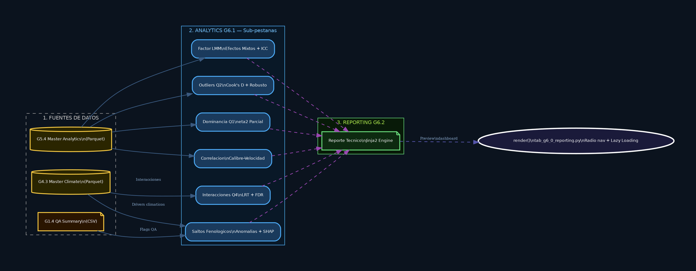
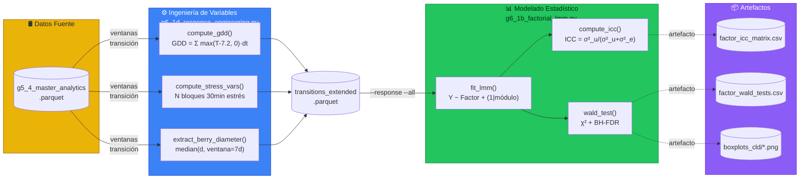

# Examples — Diagramas reales del proyecto

Extraídos del código fuente; son el estándar de calidad esperado. Para la paleta de colores, ver `paleta.md`; para sintaxis, `mermaid.md` / `graphviz.md`.

---

## Ejemplo 1 — Graphviz · Fan-out estadístico (Patrón C) en Streamlit
**Fuente**: `07_scripts/FaseG/app_calidad/tabs/subtab_g6_0_factorial_lmm.py`
1 fuente → 3 funciones de ingeniería → 1 parquet → 4 funciones estadísticas → 4 artefactos → UI.

```python
with st.expander("📊 ¿Cómo se calculó esto? — Pipeline de datos", expanded=False):
    st.graphviz_chart("""
    digraph LMM_Pipeline {
        graph [rankdir=LR, bgcolor="#0B131E", fontname="Helvetica",
               pad=0.6, splines=curved, nodesep=0.5, ranksep=1.1];
        node [fontname="Helvetica", fontcolor="white", fontsize=8,
              style="filled,rounded", margin=0.18, penwidth=1.8];
        edge [fontcolor="#8aabcf", fontsize=7, color="#3a5a80", penwidth=1.3];

        subgraph cluster_sources {
            label="1. DATOS FUENTE";
            style=dashed; color="#999999"; fontcolor="#CCCCCC"; fontsize=10;
            RAW [label="g5_4_master_analytics.parquet\\nID_baya | datetime | stage\\nCIELAB a*/b*/L* | diametro_px\\nmodulo | lote | variedad | productor",
                 shape=cylinder, fillcolor="#2a2500", color="#f5c842"];
        }
        subgraph cluster_engineering {
            label="2. INGENIERIA DE VARIABLES\\ng6_1d_response_engineering.py";
            style=filled; fillcolor="#091827"; color="#4dabf7";
            fontcolor="#74c0fc"; fontsize=10;
            FN_GDD [label="compute_gdd()\\nGDD = SUM max(T - 7.2, 0) * dt\\nTbase=7.2 C | dt=0.5h (bloques 30min)",
                    shape=box, fillcolor="#1a3a5c", color="#4dabf7"];
            FN_STRESS [label="compute_stress_vars()\\nN bloques 30min con condicion activa:\\nT>30C | DPV>1.6kPa | Rad>1000W/m2\\nHR>90% | T<10C",
                       shape=box, fillcolor="#1a3a5c", color="#4dabf7"];
            FN_DIAM [label="extract_berry_diameter()\\ndiam = median(d_px, ventana=7d pre-fin)\\ndoy_start_FC = DOY inicio FLOR_CERRADA",
                     shape=box, fillcolor="#1a3a5c", color="#4dabf7"];
            TRANS [label="transitions_extended.parquet\\n8 variables respuesta | N bayas | 10 transiciones",
                   shape=note, fillcolor="#050e1a", color="#74c0fc"];
            FN_GDD -> TRANS; FN_STRESS -> TRANS; FN_DIAM -> TRANS;
        }
        subgraph cluster_lmm {
            label="3. MODELADO ESTADISTICO\\ng6_1b_factorial_lmm.py";
            style=filled; fillcolor="#081a08"; color="#69db7c";
            fontcolor="#a9e34b"; fontsize=10;
            FN_LMM [label="fit_lmm() — Modelo Lineal Mixto\\nY_ij = mu + beta*Factor_i + u_j + e_ij\\nu_j ~ N(0,sigma_u) | e ~ N(0,sigma_e)\\nflags: --response --all --include-doy",
                    shape=box, fillcolor="#0d2a10", color="#69db7c"];
            FN_ICC [label="compute_icc()\\nICC = sigma_u^2 / (sigma_u^2 + sigma_e^2)\\n<0.10 irrelevante | >0.50 dominante",
                    shape=box, fillcolor="#0d2a10", color="#69db7c"];
            FN_WALD [label="wald_test() — Type III chi-cuadrado\\nchi2_Wald = (beta / SE_beta)^2\\neta2_parcial = chi2 / (chi2 + df_res)\\nBH-FDR: p_adj = p * m / rank(p)",
                     shape=box, fillcolor="#0d2a10", color="#69db7c"];
            FN_CLD [label="cld_letters() — Tukey HSD post-hoc\\nComparacion pares con alpha=0.05\\nCompact Letter Display: Piepho (2004)",
                    shape=box, fillcolor="#0d2a10", color="#69db7c"];
            FN_LMM -> FN_ICC; FN_LMM -> FN_WALD; FN_LMM -> FN_CLD;
        }
        subgraph cluster_outputs {
            label="4. ARTEFACTOS DE SALIDA";
            style=filled; fillcolor="#140a22"; color="#da77f2";
            fontcolor="#cc5de8"; fontsize=10;
            OUT_ICC  [label="factor_icc_matrix.csv\\nHeatmap ICC | Factor x Transicion",
                      shape=note, fillcolor="#2a0d35", color="#da77f2"];
            OUT_WALD [label="factor_wald_tests.csv\\nchi2 | p_value | p_adj_fdr | eta2_parcial",
                      shape=note, fillcolor="#2a0d35", color="#da77f2"];
            OUT_BOX  [label="boxplots_cld/*.png\\nBox Plots con letras CLD por factor",
                      shape=note, fillcolor="#2a0d35", color="#da77f2"];
            OUT_CLD  [label="cld_letters_*.csv\\nMedias y letras por nivel de factor",
                      shape=note, fillcolor="#2a0d35", color="#da77f2"];
        }
        UI [label="render()\\nsubtab_g6_0_factorial_lmm.py",
            shape=ellipse, fillcolor="#1a1a3a", color="white", penwidth=2.5];

        RAW -> FN_GDD [label="ventanas de\\ntransicion fenologica"];
        RAW -> FN_STRESS; RAW -> FN_DIAM;
        TRANS -> FN_LMM [label="--response={var}\\n--all --include-doy"];
        FN_ICC  -> OUT_ICC  [style=dashed, color="#9a47b2"];
        FN_WALD -> OUT_WALD [style=dashed, color="#9a47b2"];
        FN_CLD  -> OUT_BOX  [style=dashed, color="#9a47b2"];
        FN_CLD  -> OUT_CLD  [style=dashed, color="#9a47b2"];
        OUT_ICC  -> UI [style=dashed, color="#5555aa", label="ICC heatmap\\n+ download CSV"];
        OUT_WALD -> UI [style=dashed, color="#5555aa", label="Wald table\\n+ download CSV"];
        OUT_BOX  -> UI [style=dashed, color="#5555aa", label="CLD boxplots\\n+ st.image"];
    }
    """, use_container_width=True)
    st.caption("Ejecutar: `python g6_1d_response_engineering.py` → `python g6_1b_factorial_lmm.py --all`")
```

> Este ejemplo usa la **variante Streamlit dark** (fondo fijo `#0B131E`). Para README/docs que pueden verse en claro u oscuro, usa la paleta canónica de `paleta.md`.

---

## Ejemplo 2 — Graphviz · Orquestador (múltiples fuentes → múltiples análisis)
**Fuente**: `07_scripts/FaseG/app_calidad/tabs/tab_g6_0_reporting.py` — arquitectura macro del tab G.6.



---

## Ejemplo 3 — Mermaid · Flowchart para README (paleta canónica)
Mismo pipeline en Mermaid, con la paleta de `paleta.md` (legible en claro y oscuro):



---

## Reutilizar
- **Ejemplo 1** → pipeline con un modelo y N métricas (Patrón C), Streamlit dark.
- **Ejemplo 2** → tabs orquestadores con múltiples fuentes y sub-análisis.
- **Ejemplo 3** → README/docs en Mermaid con paleta canónica.
- Patrón B (ramas paralelas) → `subtab_g6_0_outliers_q2.py`; Patrón D (LRT anidado) → `subtab_g6_0_interacciones_q4.py`.
