# Reference — Mermaid (catálogo, sintaxis y ejemplo)

Doc oficial vía context7: `libraryId: /mermaid-js/mermaid`. Si una sintaxis no está aquí o es `-beta`, consúltala con `mcp__context7__query-docs` antes de generar.

---

## §A — Catálogo de tipos (esqueletos mínimos)

Cada bloque empieza con su keyword. Para detalle/atributos avanzados → context7.

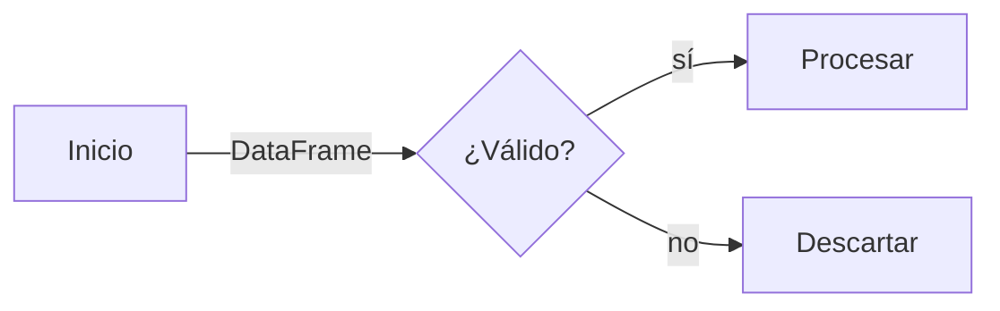
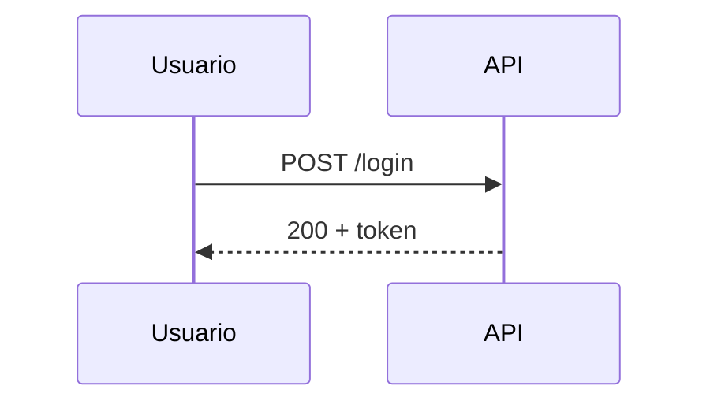
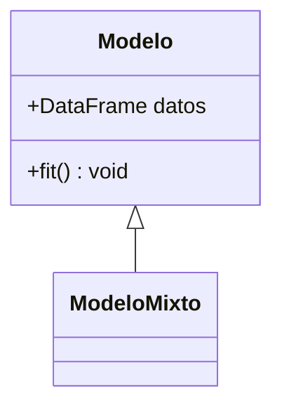
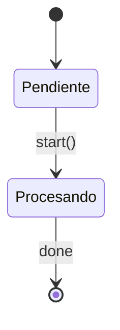
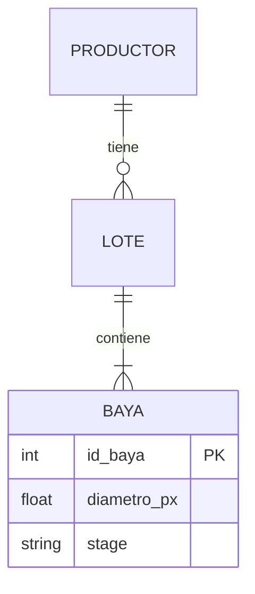
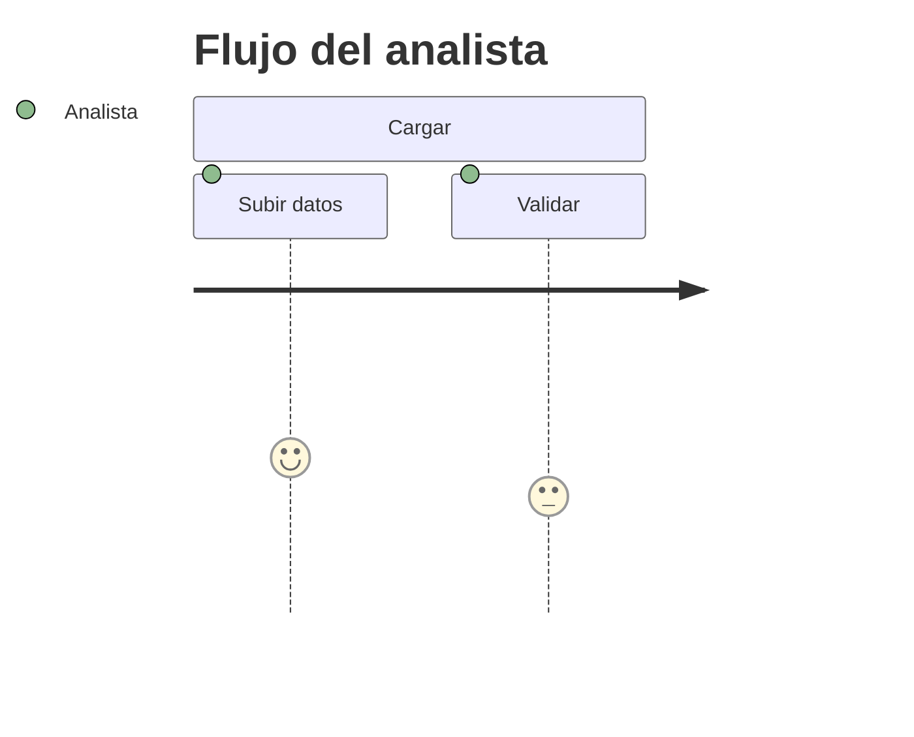
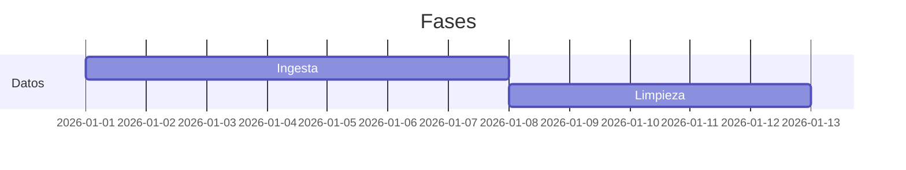
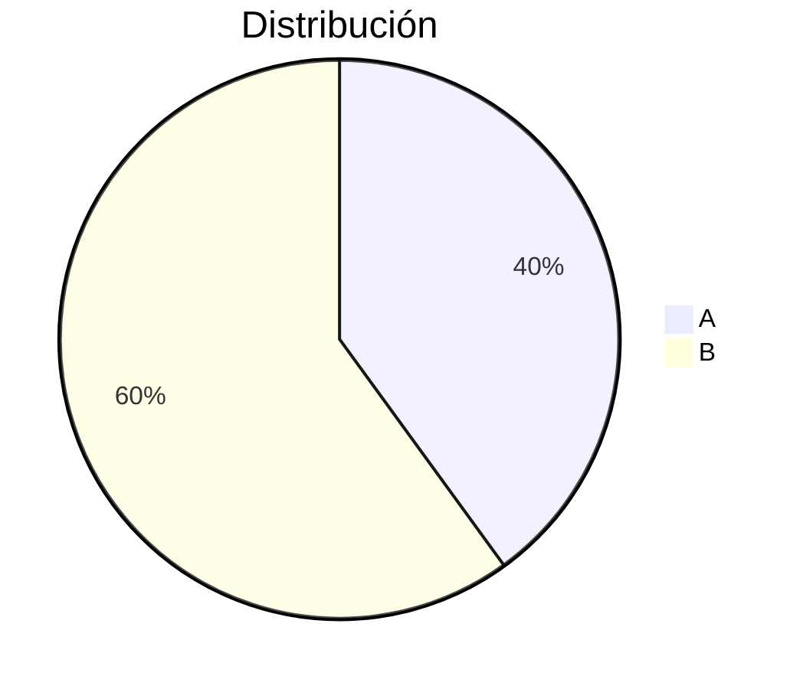
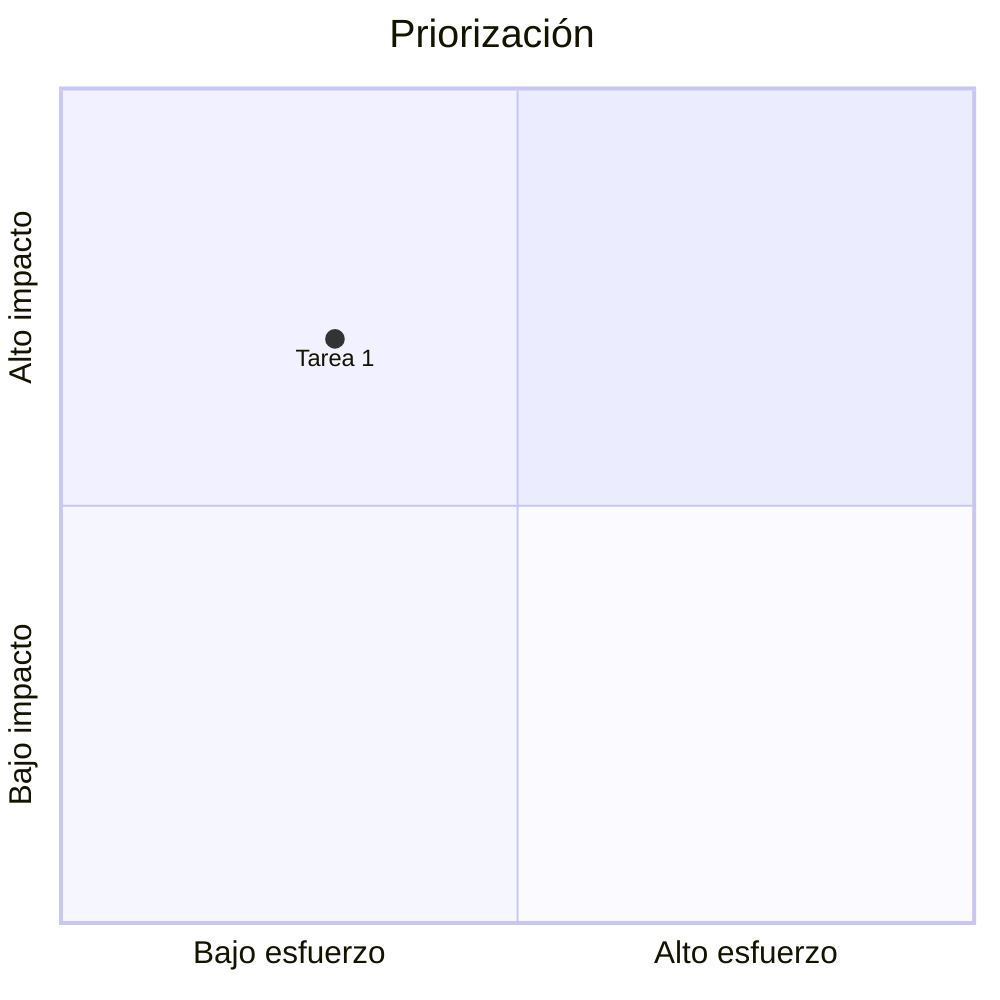
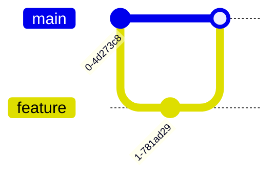
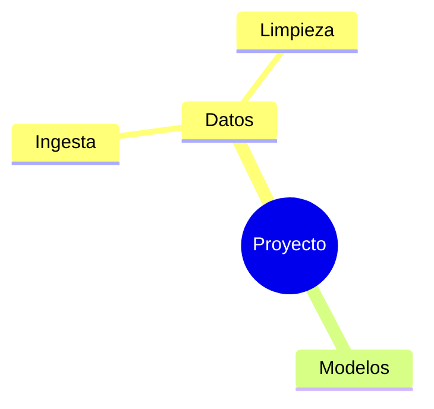
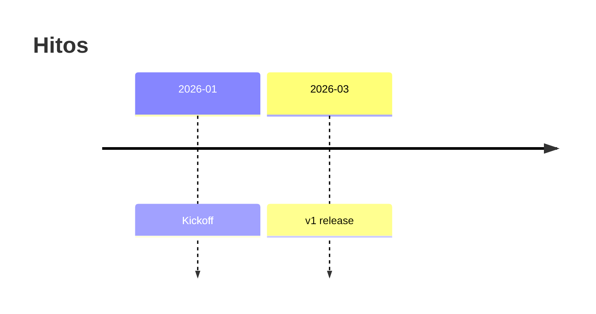
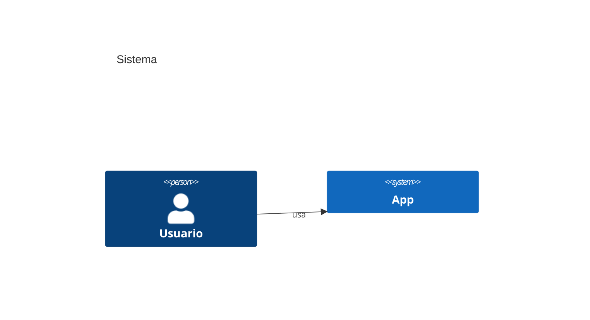

**Beta / verificar con context7 antes de usar:** `sankey-beta`, `xychart-beta`, `block-beta`, `packet-beta`, `architecture-beta`, `radar`, `treemap`, `requirementDiagram`, `kanban`. Su sintaxis cambia entre versiones de Mermaid.

**Cardinalidades erDiagram:** `||` uno-exacto · `o{` cero-o-muchos · `|{` uno-o-muchos · `o|` cero-o-uno. Ej: `A ||--o{ B : etiqueta`.

---

## §B — Estándar visual Mermaid

- En `flowchart`, **nunca dejes flechas vacías**: anota el dato que cruza (`[DataFrame]`, `[p-value]`, `[JSON]`).
- **Colores: usa SIEMPRE la paleta canónica** (`paleta.md`) vía `classDef`/`style`. No inventes tonos por diagrama. Se lee igual en fondo claro y oscuro.
- En `erDiagram`: usa los atributos y tipos reales del esquema y cardinalidades correctas.

> Ejemplo completo de flowchart para README con la paleta canónica → `examples.md` (Ejemplo 3).
