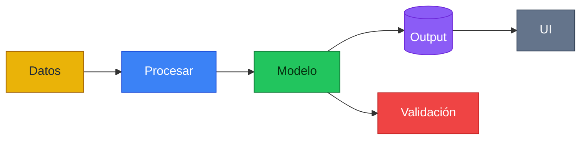

# Reference — Paleta canónica (usar SIEMPRE)

Una sola paleta para todos los diagramas, elegida para que **se lea igual de bien sobre fondo negro y sobre fondo blanco**. Los rellenos son tonos medios saturados (visibles en ambos fondos), el borde es una variante más oscura del mismo color, y el color de texto se fija por relleno para mantener contraste AA.

> Regla: no inventes colores nuevos por diagrama. Usa estos 6 roles. Si un rol no aplica, omítelo, no lo sustituyas por otro tono.

## Roles y hex

| Rol | Relleno (fill) | Borde (stroke) | Texto | Emoji |
|---|---|---|---|---|
| **Datos / Fuente** | `#EAB308` | `#A16207` | `#1F2937` (oscuro) | 🛢️ |
| **Procesamiento / Ingeniería** | `#3B82F6` | `#1D4ED8` | `#FFFFFF` | ⚙️ |
| **Modelado / Análisis** | `#22C55E` | `#15803D` | `#06310F` (oscuro) | 📊 |
| **Artefactos / Outputs** | `#8B5CF6` | `#6D28D9` | `#FFFFFF` | 📦 |
| **Riesgo / Robusto / Alerta** | `#EF4444` | `#B91C1C` | `#FFFFFF` | 🔴 |
| **UI / Entrada-salida** | `#64748B` | `#334155` | `#FFFFFF` | 🖥️ |

Por qué funciona en ambos fondos: ninguno de los rellenos es casi-negro ni casi-blanco, así que el nodo siempre destaca contra negro **y** contra blanco; el borde más oscuro lo separa del fondo blanco, y el texto fijado por relleno mantiene legibilidad.

Las flechas/aristas en tono neutro `#64748B` (borde `#334155`) se ven en ambos fondos; nunca uses gris claro (`#CCC`) ni gris muy oscuro.

---

## §M — Aplicar en Mermaid (`classDef`)

Pega este bloque y asigna clases con `:::rol` o `class A,B rol;`:

Para `subgraph`, aplica `style NOMBRE fill:#...,stroke:#...,color:#...` con los mismos hex.

---

## §G — Aplicar en Graphviz

Define defaults y úsalos por nodo. Sirve con `bgcolor` claro u oscuro:

> **Variante Streamlit dark** (solo cuando el fondo es siempre `#0B131E`): existe una paleta dark de alto contraste en `graphviz.md §1`. Úsala únicamente dentro de `st.graphviz_chart`; para todo lo demás (README, docs, exports que pueden verse en claro u oscuro) usa esta paleta canónica.
