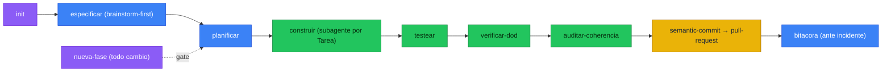

<h1 align="center">project-suite</h1>

<p align="center">
  <em>Planifica en documentos primero. El código sigue al plan, nunca al revés.</em>
</p>

<p align="center">
  
  
  
  
</p>

---

Le pides una feature a un agente sin este plugin: escribe el código directo, marca la tarea como hecha, y tres semanas después nadie recuerda por qué existe esa decisión de arquitectura ni si los tests que dice tener realmente corrieron.

Con project-suite, ese mismo pedido primero se convierte en una Fase con Sub fases y Tareas en un documento — y el checkbox `[X]` solo se marca cuando `verificar-dod` confirma que los tests pasaron.

## Antes / después

**Sin el plugin**, "agrega login social" se convierte directo en código: el agente elige un proveedor, escribe el endpoint, y sigue. Nadie decidió eso, nadie lo documentó, y si el enfoque estaba mal ya hay tres archivos que revertir.

**Con `nueva-fase` + `construir`:**

```
Fase 4 — Autenticación social
  SF4.1 — Integración OAuth (Google + GitHub)
    T4.1.1 — Endpoint de callback OAuth
      AC: redirige con token válido; rechaza state inválido
      Test unitario: valida firma del state parameter
      Test de simulación de usuario: login completo end-to-end
```

El plan se escribe y se aprueba **antes** de que exista una línea de código. `construir` despacha un subagente por Tarea, cada uno cierra con `testear` + `verificar-dod` — y solo entonces el checkbox pasa a `[X]`.

## Cómo funciona



1. **`init`** arranca el proyecto: entrevista de diseño tipo brainstorming (una pregunta a la vez, gate de aprobación) → `docs/` desde plantillas → `CLAUDE.md`/`AGENTS.md` con las reglas → `.gitignore`.
2. **`nueva-fase`** es el gate de todo cambio posterior: antes de tocar código, evalúa si la feature necesita una Fase nueva y la redacta con sus Tareas y tests.
3. **`construir`** ejecuta el plan: un subagente por Tarea, contexto acotado, cierra con `testear` (crea y corre los dos niveles de test obligatorios) + `verificar-dod` (el gate real — sin verde, no hay `[X]`).
4. **`auditar-coherencia`** detecta cuando el código se desvía de `architecture.md`/`diseno_db.md`. **`bitacora`** registra incidentes para no repetir el mismo bug dos veces.
5. Todo commit pasa por `semantic-commit`; todo PR, por `pull-request` — nunca push directo, nunca `--no-verify` sin permiso explícito.

Los documentos viven en `docs/` dentro de tu repo (auditables), en el idioma que elijas (`es | en`). Los archivos de trabajo (`docs/task/`, `docs/plan/`, `docs/logs/`, `CLAUDE.md`, `AGENTS.md`) quedan **locales por defecto** — no se versionan salvo que lo pidas al iniciar.

## Comandos

| Comando | Qué hace |
|---|---|
| `/project-suite:init [idea]` | Arranca un proyecto: entrevista de diseño → `docs/` → reglas → `.gitignore` → autoría. |
| `/project-suite:nueva-fase [cambio]` | Gate spec-driven: evalúa si un cambio amerita una nueva Fase y la redacta **antes** de codear. |

## Skills

**Documentos:** `especificar` (description + architecture + diseño DB), `planificar` (plan maestro + tareas), `bitacora` (log de incidentes), `ejecucion` (guía de arranque/deploy).

**El loop de calidad:** `testear` (crea y corre tests unitarios + simulación de usuario), `verificar-dod` (gate de Definition-of-Done, sin verde no hay `[X]`), `auditar-coherencia` (drift docs↔código), `construir` (ejecuta el plan por subagentes, uno por Tarea).

**Estándares de lenguaje:** `python`, `r`, `rust`, `astro`, `sql`, `ts`, `webapp`.

**Empaquetadas:** `generar-diagramas` (Mermaid), `semantic-commit`, `pull-request`, `caveman`.

## Install

### Claude Code

```
/plugin marketplace add C:\Users\aprieto\Github\project-suite
/plugin install project-suite@project-suite-marketplace
```

Pregunta al instalar: idioma de documentación por defecto (`es | en`) y si versionar los archivos de trabajo (`version_working_files`, por defecto **no**).

### opencode

El repo trae un árbol generado desde la misma fuente:

- `.opencode/skills/` — las 19 skills (SKILL.md nativo de opencode)
- `.opencode/command/` — `/init`, `/nueva-fase` (sin prefijo)
- `opencode.json` — el server `codegraphcontext`

Abre opencode dentro del repo (lee `.opencode/` + `opencode.json`), o copia `.opencode/*` a `~/.config/opencode/` y fusiona el bloque `mcp`.

> `.opencode/` y `opencode.json` son **generados**, no los edites a mano. Tras tocar `skills/`, `commands/` o `.mcp.json`: `python scripts/sync_opencode.py`. Verifica con `python scripts/validate_plugin.py`.

## MCP servers

| Server | Alcance | Por qué |
|---|---|---|
| `codegraphcontext` | Por defecto, global | Indexa el código local en un grafo (`uvx --with kuzu codegraphcontext mcp start`; auto-instala). En Windows usa **KuzuDB** — el backend por defecto (FalkorDB Lite) es solo-Unix. |
| `context7` | *No se empaqueta* | Usa el server global que ya tengas — empaquetar un segundo causa desconexiones. |
| `playwright` | Por proyecto (solo apps web/UI) | `init` lo agrega al `.mcp.json` del proyecto para los tests de simulación de usuario. |

## Autoría

`init` fija el autor de docs y commits desde tu identidad git (el usuario de GitHub conectado, si lo hay) o preguntándolo en repos locales — y lo persiste en `CLAUDE.md`/`AGENTS.md` para no volver a preguntar. **Sin coautoría LLM por defecto**: ningún commit lleva `Co-Authored-By` salvo que lo habilites explícitamente en esa sección o lo pidas.

## FAQ

**¿Puedo saltarme la planificación para algo trivial?**
El diseño no lo impide, pero la disciplina del plugin es "planifica primero" incluso para cambios chicos — el costo de una Fase de una Tarea es bajo comparado con el de código sin rastro de por qué existe.

**¿Qué pasa si `verificar-dod` falla?**
`construir` para esa rama, no marca el checkbox, y reporta qué item del DoD no pasó (test rojo, lint con warnings, cambio de DB sin documentar). Tú decides: corregir o replanificar.

**¿Por qué los docs de trabajo (`plan/`, `task/`, `logs/`) no se versionan por defecto?**
Son estado de proceso, no el contrato compartible del proyecto. La spec (`description`, `architecture`, `db`, `ejecucion`) sí se versiona siempre. Si trabajas en equipo y quieres compartir el plan, cambia `version_working_files` a `yes`.

## Método

7 plantillas encadenadas (`templates/`): `description_proyecto` → `architecture` → `diseno_db` → `plan_maestro` → `tareas` → `log` → `ejecucion`. Es una versión domain-specific, anclada a documentos, del flujo de `superpowers` (brainstorming → writing-plans → subagent-driven-development → TDD → verification).

Diseño y plan completos: [`docs/superpowers/specs/2026-07-01-project-suite-design.md`](docs/superpowers/specs/2026-07-01-project-suite-design.md) · [`docs/superpowers/plans/2026-07-01-project-suite.md`](docs/superpowers/plans/2026-07-01-project-suite.md).

## Licencia

MIT.
