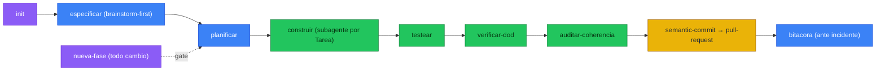

# project-suite

Plugin de Claude Code para **proyectos spec-driven**: primero se planifica en documentos, luego se construye por fases con gates de calidad forzados (commits semánticos, PRs, tests obligatorios, bitácora de incidentes, coherencia docs↔código).

Los documentos viven en el repo donde corres el agente (`docs/`, auditable) y el plugin genera un `CLAUDE.md`/`AGENTS.md` que obliga el flujo. Todo el plugin está escrito en inglés; los documentos se generan en el idioma que elijas (`es | en`).

## El loop



## Comandos

| Comando | Qué hace |
|---|---|
| `/project-suite:init [idea]` | Arranca un proyecto: entrevista de diseño → `docs/` desde plantillas → `CLAUDE.md`/`AGENTS.md` → `.gitignore`. |
| `/project-suite:nueva-fase [cambio]` | Gate spec-driven: evalúa si un cambio amerita una nueva Fase y la redacta (Fase+Tareas) **antes** de codear. |

## Skills

**Core (documentos):** `especificar` (description + architecture + diseño DB), `planificar` (plan maestro + tareas), `bitacora` (log de incidentes), `ejecucion` (guía de arranque/deploy).

**Loop + ejecución:** `testear` (crea y corre tests unitarios + simulación de usuario), `verificar-dod` (gate de Definition-of-Done por tarea), `auditar-coherencia` (drift docs↔código), `construir` (ejecuta el plan encadenando cada Fase/Tarea en subagentes).

**Estándares de lenguaje:** `python-standards`, `r-standards`, `rust-standards`, `astro-standards`, `sql-standards`, `ts-standards`, `webapp-standards`.

**Empaquetadas:** `generar-diagramas` (Mermaid), `semantic-commit`, `pull-request`, `caveman`.

## MCP servers

- **codegraphcontext** (por defecto): indexa el código local en un grafo para dar vista general del proyecto. Arranca con `uvx --with kuzu codegraphcontext mcp start` (auto-instala en el primer uso).
  - **Windows:** el backend por defecto (FalkorDB Lite) es solo-Unix, por eso se usa **KuzuDB** (nativo, requiere Python 3.12+). Si el backend no se autoselecciona, corre una vez: `codegraphcontext config db` → KuzuDB.
- **context7**: *no* se empaqueta a propósito — usa el server global que ya tengas (empaquetar un segundo causa desconexiones).
- **playwright**: no es global; `init` lo agrega al `.mcp.json` del proyecto solo si es una app web/UI (para los tests de simulación de usuario).

## Instalación

Marketplace local (mismo patrón que otros plugins de este equipo):

```
/plugin marketplace add C:\Users\aprieto\Github\project-suite
/plugin install project-suite@project-suite-marketplace
```

Al instalar se pregunta el idioma de documentación por defecto (`es | en`).

## Método

El plugin materializa 7 plantillas encadenadas (`templates/`): `description_proyecto` → `architecture` → `diseno_db` → `plan_maestro` → `tareas` → `log` → `ejecucion`. Es una versión domain-specific, anclada a documentos, del flujo de `superpowers` (brainstorming → writing-plans → subagent-driven-development → TDD → verification).

Diseño y plan completos: [`docs/superpowers/specs/2026-07-01-project-suite-design.md`](docs/superpowers/specs/2026-07-01-project-suite-design.md) · [`docs/superpowers/plans/2026-07-01-project-suite.md`](docs/superpowers/plans/2026-07-01-project-suite.md).
