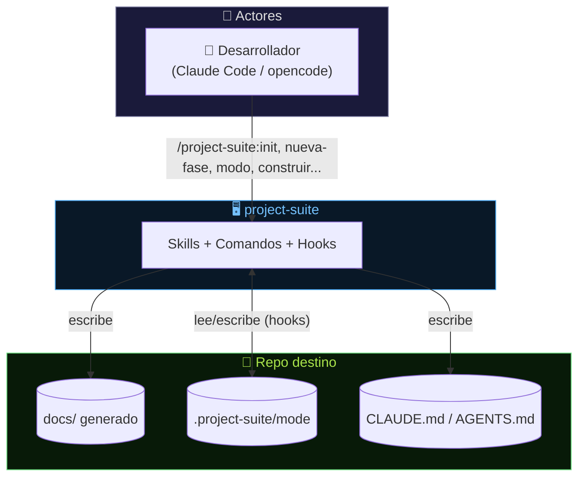
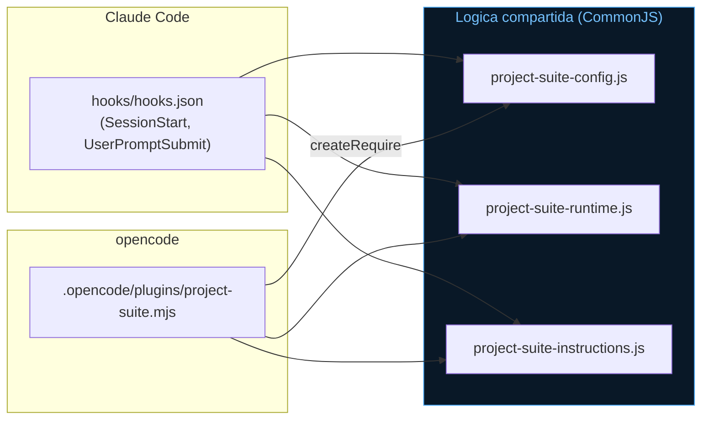
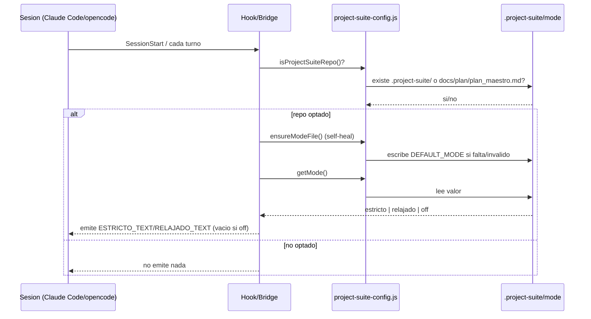
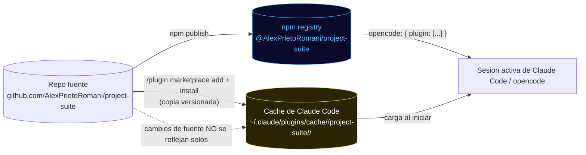

# Arquitectura — project-suite

> Este documento describe project-suite organizado por **flujos**: cómo un comando/skill produce un efecto real (archivos escritos, un hook disparado). Las fases de construcción del plugin viven en `docs/superpowers/plans/`; el detalle exhaustivo del feature de modo vive en `docs/superpowers/specs/2026-07-02-modo-hooks-design.md`.

---

## 1. Visión General del Sistema (C4 – Nivel Contexto)

**Decisiones arquitectónicas clave (Nivel Macro):**
- El plugin no tiene servidor propio ni base de datos — es Markdown (skills/comandos) + Node.js (hooks) + Python (scripts de validación/sync), todo stdlib.
- Todo el estado que el plugin genera vive **en el repo destino**, no en el plugin mismo — auditable, versionable a criterio del usuario.

## 2. Componentes Internos (C4 – Nivel Contenedor)

Una sola fuente de lógica (`hooks/project-suite-*.js`), dos entrypoints delgados por herramienta — evita duplicar la resolución de modo entre Claude Code y opencode.

---

## 🔄 Flujos de datos — mapa maestro

| # | Flujo | Entrada | Proceso | Salida |
|---|---|---|---|---|
| 1 | Scaffold inicial | `/init` | Entrevista + genera desde `templates/` | `docs/`, `CLAUDE.md`/`AGENTS.md`, `.gitignore` |
| 2 | Gate de cambio nuevo | `/nueva-fase` | Evalúa y redacta Fase antes de codear | `plan_maestro.md` + `tareas.md` actualizados |
| 3 | Recordatorio ambiental | `SessionStart` / `UserPromptSubmit` | Resuelve modo, emite texto | Contexto de sesión / `.project-suite/mode` |
| 4 | Ejecución del plan | `construir` | Subagente por Tarea + `testear` + `verificar-dod` | Checkboxes `[X]` en `tareas.md`, commits |
| 5 | Sync multi-herramienta | `scripts/sync_opencode.py` | Espeja `skills/`/`commands/`/`.mcp.json` | `.opencode/`, `opencode.json` |
| 6 | Revision de diff | `/review` | Compara diff contra plan y spec | Reporte de desviaciones (sin modificar archivos) |
| 7 | Auditoria global | `/audit` | Recorre TODO el repo contra architecture/diseno_db | Reporte de drift (sin modificar archivos) |

## 3. Flujo 1 — Scaffold inicial (`init`)

**Entrada → Proceso → Salida:** entrevista de diseño → genera `docs/` + reglas + gitignore → repo destino listo para planificar.

Script: `commands/init.md` (skills invocadas: `especificar`, `planificar`, `ejecucion`).

### 3.2 Reglas e invariantes

| Regla | Descripción |
|---|---|
| Autosuficiencia de reglas | `CLAUDE.md`/`AGENTS.md` se generan cada uno con el cuerpo COMPLETO de `templates/generated/rules-body.tmpl.md` — nunca un puntero al otro. |
| Detección de herramienta | `echo $CLAUDE_PLUGIN_ROOT` decide el default sugerido de qué archivo generar, pero SIEMPRE se pregunta. |
| Archivos de trabajo locales por defecto | `docs/task/`, `docs/plan/`, `docs/logs/`, `CLAUDE.md`, `AGENTS.md`, `.project-suite/` van a `.gitignore` salvo `version_working_files: yes`. |

## 4. Flujo 2 — Gate de cambio nuevo (`nueva-fase`)

**Entrada → Proceso → Salida:** petición de cambio → decide si amerita Fase nueva → la redacta con Tareas y tests, sin codear.

Script: `commands/nueva-fase.md`.

### 4.2 Reglas e invariantes

| Regla | Descripción |
|---|---|
| Para antes de codear | El comando nunca escribe código de features — solo actualiza `plan_maestro.md`/`tareas.md`. |

## 5. Flujo 3 — Recordatorio ambiental de modo

**Entrada → Proceso → Salida:** evento de sesión o prompt del usuario → resuelve/persiste modo → texto de recordatorio o confirmación.

Scripts: `hooks/project-suite-activate.js` (SessionStart), `hooks/project-suite-mode-tracker.js` (UserPromptSubmit), `.opencode/plugins/project-suite.mjs` (equivalente opencode).

### 5.1 Diagrama — resolución de modo y persistencia

### 5.2 Reglas e invariantes

| Regla | Descripción |
|---|---|
| Nunca toca repos no-opt-in | `isProjectSuiteRepo()` es el guard en ambos entrypoints y el bridge opencode. |
| Self-healing, no destructivo | Un archivo `.project-suite/mode` con contenido inválido se repara a `estricto`; uno válido (aunque no default) nunca se sobreescribe. |
| Deteccion determinista del cambio de modo | `UserPromptSubmit` regexea el prompt crudo (`^/project-suite:modo\b`) y persiste por código, sin depender de que el modelo obedezca. |
| Nunca lanza sin capturar | `setMode`/`ensureModeFile` envuelven sus operaciones de filesystem en try/except, degradando a `null`/`false` en vez de crashear la sesión. |

## 6. Flujo 4 — Ejecución del plan (`construir`)

**Entrada → Proceso → Salida:** `plan_maestro.md` + `tareas.md` → subagente por Tarea → checkbox `[X]` solo si `verificar-dod` pasa.

### 6.2 Reglas e invariantes

| Regla | Descripción |
|---|---|
| El checkbox es sagrado | Nunca se marca `[X]` sin que `verificar-dod` haya pasado en verde. |
| Contexto acotado | Cada subagente recibe solo la Tarea + `*-standards` aplicables, no el plan completo. |

## 7. Flujo 5 — Sync multi-herramienta

**Entrada → Proceso → Salida:** `skills/`, `commands/`, `.mcp.json` (fuente canónica) → `scripts/sync_opencode.py` → `.opencode/`, `opencode.json`.

### 7.2 Reglas e invariantes

| Regla | Descripción |
|---|---|
| Generado, no editable a mano | `.opencode/` y `opencode.json` se regeneran siempre; ediciones manuales se pierden en el próximo sync. |
| `.opencode/plugins/project-suite.mjs` es la excepción | Es hand-authored y checked-in, el sync solo lo REGISTRA en `opencode.json`, nunca lo sobreescribe. |

---

## 8. Arquitectura de despliegue

**Notas de despliegue:**
- **Claude Code:** marketplace local, caché versionada por `plugin.json`.
- **opencode:** desde npm (`@AlexPrietoRomani/project-suite`) o checkout local (`.opencode/plugins/project-suite.mjs`).
- La caché se indexa por número de versión — sin bump de `plugin.json`, `/plugin marketplace update` puede no detectar cambios.
- No hay build/compilación — el plugin es Markdown + JS/Python interpretados directamente.

## 9. Decisiones arquitectónicas (ADRs)

| Decisión Tomada | Alternativa Descartada | Razón Principal |
|---|---|---|
| Hooks de Claude Code + puente opencode compartiendo módulos CJS | Reimplementar la lógica de modo por herramienta | Una sola fuente de verdad; menos superficie de bugs |
| Recordatorio ambiental liviano (texto estático por modo) | Escanear git diff/tareas.md en cada turno | Más barato, y la verificación real ya vive en `verificar-dod`/`auditar-coherencia`/`testear` |
| `CLAUDE.md`/`AGENTS.md` generados completos desde un solo cuerpo | Uno canónico + el otro puntero | El puntero se rompía si solo se generaba el archivo no-canónico (bug real encontrado y corregido) |
| `docs/plan`/`docs/task` versionados en este propio repo (a diferencia del default para proyectos destino) | Dejarlos locales como en cualquier proyecto destino | Transparencia para colaboradores de un repo de plugin es justo el punto |
