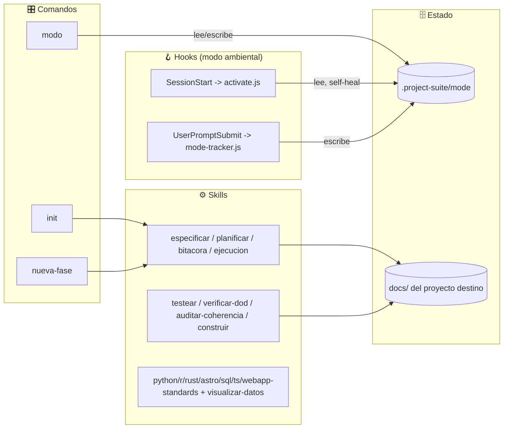
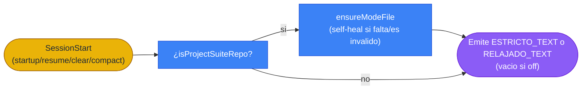

# Documento de Definición Técnica — project-suite

> Fuente de verdad funcional del plugin **project-suite**: qué hace, para quién, cómo fluye la disciplina spec-driven.

## 0. Resumen ejecutivo

- **Propósito:** scaffolding y gobierno de proyectos spec-driven — planificar en documentos antes de codear, construir por Fases con gates de calidad forzados.
- **Usuarios objetivo:** desarrolladores usando Claude Code u opencode que quieran disciplina de planificación en sus propios proyectos.
- **Casos de uso principales:**
  1. Un usuario corre `/project-suite:init` en un repo nuevo → obtiene `docs/` completo (especificación, arquitectura, DB, plan, tareas) + reglas de operación (`CLAUDE.md`/`AGENTS.md`) + `.gitignore`.
  2. Un usuario pide un cambio nuevo → `/project-suite:nueva-fase` evalúa si amerita una Fase nueva y la redacta antes de que se escriba código.
  3. Un usuario corre `/project-suite:construir` → el plan se ejecuta Fase por Fase, un subagente por Tarea, cerrando cada una con `testear` + `verificar-dod`.

## 1. Arquitectura de componentes



### Glosario de componentes

| Componente | Responsabilidad | ¿Escribe o solo lee? |
|---|---|---|
| Comandos (`init`, `nueva-fase`, `modo`) | Orquestan flujos completos invocando skills | Ambas |
| Skills de documentos (`especificar`, `planificar`, `bitacora`, `ejecucion`) | Generan/actualizan `docs/` del proyecto destino | Escribe |
| Skills de loop (`testear`, `verificar-dod`, `auditar-coherencia`, `construir`) | Cierran el ciclo de calidad de cada Tarea | Ambas |
| Skills de estándar (`*-standards`, `visualizar-datos`) | Guían la implementación por tipo de archivo/necesidad | Solo lee (guía, no ejecuta) |
| Hooks (`hooks/project-suite-*.js`) | Recordatorio ambiental de modo, persistido per-repo | Ambas |

## 2. Flujos de datos

### 2.1 Entradas y salidas

| Dirección | Fuente / Destino | Tipo de dato | Frecuencia |
|---|---|---|---|
| Entrada | Usuario (comando/skill) | Texto/argumentos | Por demanda |
| Salida | `docs/` del proyecto destino | Markdown | Por demanda |
| Salida | `.project-suite/mode` | Texto plano (un valor) | Por sesión / cambio de modo |

### 2.2 Diagrama de flujo principal (recordatorio de modo)



## 3. Modelo de datos

No aplica — project-suite no tiene una base de datos propia. El único estado persistente que el plugin mismo mantiene es `.project-suite/mode` en cada repo destino: un archivo de texto plano con un único valor (`estricto` | `relajado` | `off`). No amerita un diagrama ER; el diccionario completo de ese archivo vive en `docs/superpowers/specs/2026-07-02-modo-hooks-design.md` §2.

## 4. Contratos de interfaz

### 4B. Variables de configuración

```bash
# Ninguna requerida por el plugin en si. Los proyectos DESTINO que corren
# /project-suite:init definen las suyas propias segun su stack.
PROJECT_SUITE_MODE=[estricto|relajado|off]   # override de sesion opcional, no persistido
```

## 5. Lógica de negocio y fórmulas

No aplica — no hay cálculos matemáticos ni índices. La "lógica de negocio" del plugin es el propio flujo spec-driven (Fases → Sub fases → Tareas → gates de calidad), documentado en §1-2.

## 6. Interfaz de usuario

No aplica — no hay UI propia; los comandos y skills interactúan vía el chat de Claude Code/opencode.

## 7. Configuración y despliegue

### 7.1 Entornos

| Entorno | Cómo arrancar | Datos que usa |
|---|---|---|
| Local / desarrollo del plugin | Clonar el repo, `/plugin marketplace add <ruta>` en Claude Code | Ninguno propio |
| opencode | Abrir opencode dentro del repo (lee `.opencode/` + `opencode.json`) | Ninguno propio |

### 7.3 Restricciones del entorno

- **Caché de Claude Code versionada por carpeta:** `~/.claude/plugins/cache/<marketplace>/<plugin>/<version>/` — un simple restart de la app NO recarga cambios de fuente; hace falta `/plugin marketplace update <marketplace>` (funciona si `plugin.json`'s `version` cambió) o, si eso no crea la carpeta nueva, desinstalar/reinstalar completo. Ver `docs/ejecucion.md` para el detalle.
- **Windows:** el `codegraphcontext` MCP empaquetado usa KuzuDB (no FalkorDB, que es solo-Unix).
