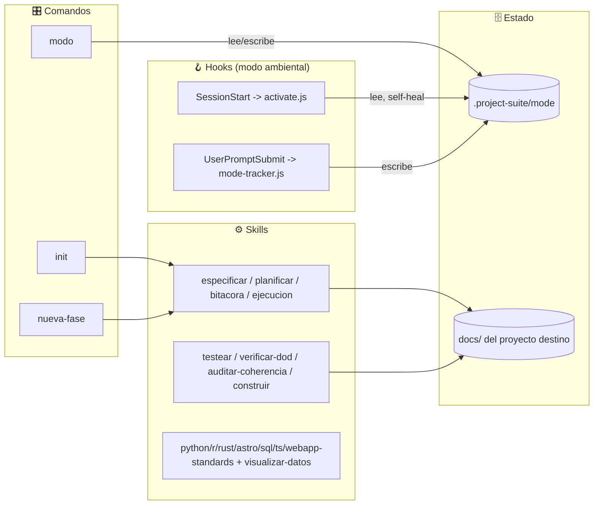
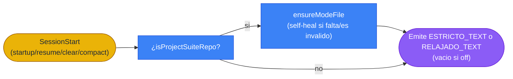
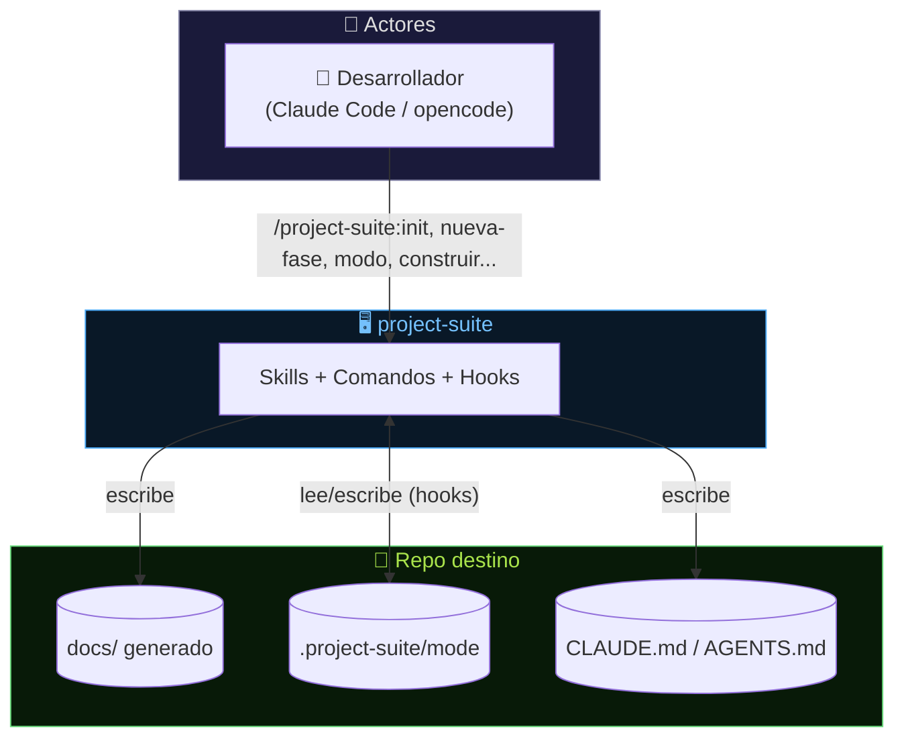
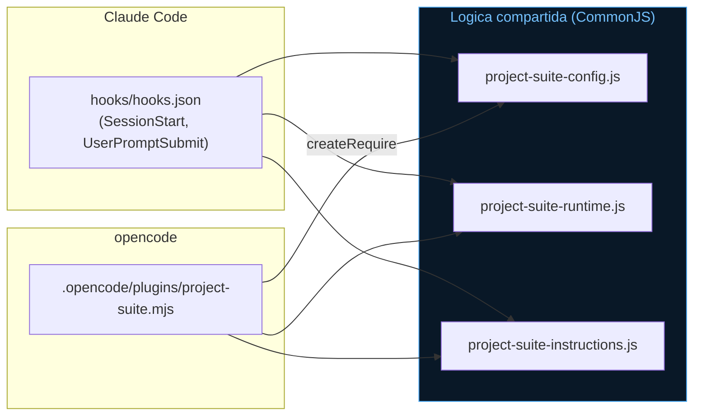
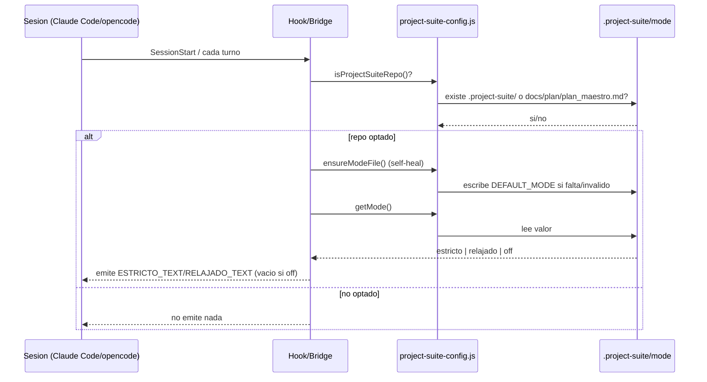
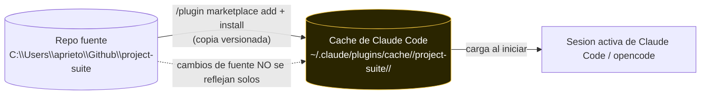
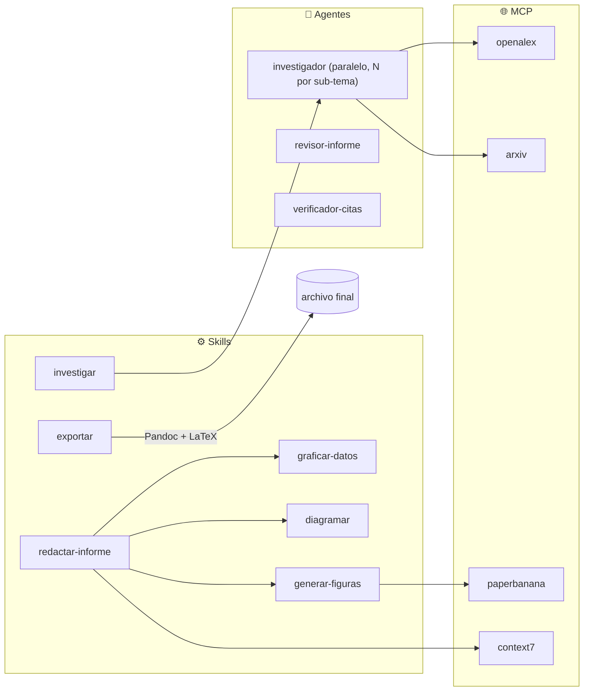
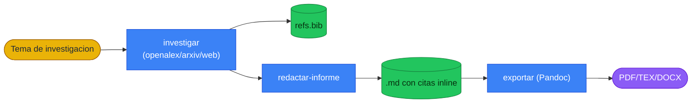
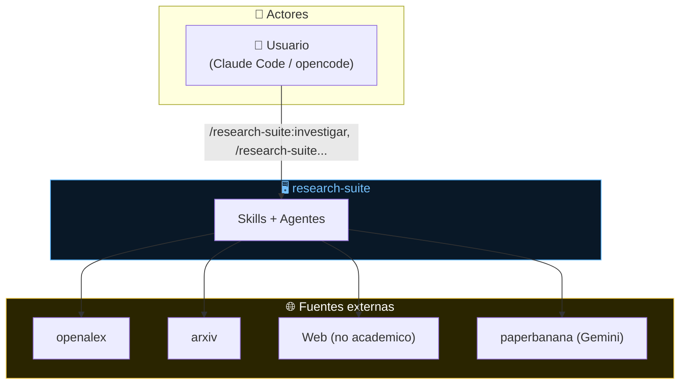
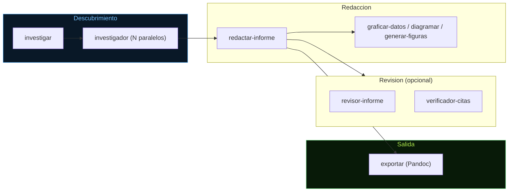

# GitHub-Ready Implementation Plan

> **For agentic workers:** REQUIRED SUB-SKILL: Use superpowers:subagent-driven-development (recommended) or superpowers:executing-plans to implement this plan task-by-task. Steps use checkbox (`- [ ]`) syntax for tracking.

**Goal:** Formalize and automatically enforce the semver versioning policy, and bring both `project-suite` and `research-suite` to a GitHub-ready, collaboration-friendly state (full plugin-self-documentation, CONTRIBUTING guide, PR template).

**Architecture:** Phase A (versioning + enforcement) ships an identical mechanism to both repos: `VERSIONING.md` (policy), `scripts/check_version_bump.py` (stdlib, pure-function classifier + version-tuple comparison), a self-check test script, and a real `pre-commit` framework config wired to run the classifier as a blocking git hook. Phase B (collaboration docs) authors the plugin-self-documentation set (`description_proyecto.md`, `architecture.md`, `ejecucion.md`, `plan_maestro.md`/`tareas.md` with a retroactive "Fase 0", `CLAUDE.md`/`AGENTS.md`, `CONTRIBUTING.md`, PR template) for each repo, reusing the same templates/structure this session already established.

**Tech Stack:** Python (stdlib only, matching the existing `validate_plugin.py`/`sync_opencode.py` convention), `pre-commit` framework (contributor-installed tool, not a plugin runtime dependency), Markdown.

**Spec:** `docs/superpowers/specs/2026-07-02-github-ready-design.md` (present in both repos).

---

## File structure

```
project-suite/                              research-suite/
├── VERSIONING.md                            ├── VERSIONING.md
├── .pre-commit-config.yaml                  ├── .pre-commit-config.yaml
├── CONTRIBUTING.md                          ├── CONTRIBUTING.md
├── CLAUDE.md                                ├── CLAUDE.md
├── AGENTS.md                                ├── AGENTS.md
├── scripts/
│   ├── check_version_bump.py                │   ├── check_version_bump.py
│   └── test_check_version_bump.py           │   └── test_check_version_bump.py
├── .github/
│   └── PULL_REQUEST_TEMPLATE.md             │   └── PULL_REQUEST_TEMPLATE.md
└── docs/
    ├── description_proyecto.md              └── docs/
    ├── architecture/architecture.md             ├── description_proyecto.md
    ├── ejecucion.md                              ├── architecture/architecture.md
    ├── plan/plan_maestro.md                      ├── ejecucion.md
    └── task/tareas.md                            ├── plan/plan_maestro.md
                                                    └── task/tareas.md
```

`docs/db/diseno_db.md` is intentionally **not created** for either repo (no real database — stated explicitly in each `description_proyecto.md` instead).

---

## Task 1: project-suite — Phase A (versioning + enforcement)

**Files:**
- Create: `project-suite/VERSIONING.md`
- Create: `project-suite/scripts/check_version_bump.py`
- Create: `project-suite/scripts/test_check_version_bump.py`
- Create: `project-suite/.pre-commit-config.yaml`

- [ ] **Step 1: Write `VERSIONING.md`**

```markdown
# Versioning Policy — project-suite

This plugin follows [Semantic Versioning](https://semver.org/) (`MAJOR.MINOR.PATCH`), with pre-1.0 conventions defined below.

## When to bump

| Change | Bump |
|---|---|
| Fix/correction to an existing skill, command, agent, hook, or script — no new capability | **PATCH** (`0.X.Y` -> `0.X.(Y+1)`) |
| A new skill, command, agent, MCP server, or external dependency (npm/pip package) is added | **MINOR** (`0.X.Y` -> `0.(X+1).0`) |
| First GitHub-ready public release (complete docs, CONTRIBUTING, pre-commit enforcement working) | **`1.0.0`** -- not a breaking-change trigger, it marks "ready to publish" |
| A breaking change (after `1.0.0`): renamed/removed skill or command, incompatible config/frontmatter schema | **MAJOR** |

## Exempt from any bump

Changes confined to `docs/`, `README.md`, `CONTRIBUTING.md`, `.github/` never require a version bump -- none of these affect what Claude Code or opencode actually load.

## Commit hygiene

A commit touching `docs/superpowers/` (design specs, implementation plans) must never also touch functional files (skills, commands, hooks, scripts) in the same commit. Keep planning docs and implementation in separate commits.

## Enforcement

`scripts/check_version_bump.py`, wired via `.pre-commit-config.yaml`, checks every commit against this policy and blocks it if the required bump is missing. See `CONTRIBUTING.md` for setup (`pip install pre-commit && pre-commit install`). Escape hatch: `git commit --no-verify` when a bump genuinely doesn't apply and the hook's heuristic is wrong.
```

- [ ] **Step 2: Write `scripts/check_version_bump.py`**

```python
#!/usr/bin/env python3
"""Pre-commit hook: enforce the semver policy in VERSIONING.md.

- PATCH required for any substantive change (fix to existing content).
- MINOR required if a new skill/command/agent/MCP server/dependency was added.
- Changes confined to docs/, README.md, CONTRIBUTING.md, .github/ are exempt.

Exit 0 = pass. Exit 1 = fail (commit blocked); message explains why.
"""
import re
import subprocess
import sys
from pathlib import Path

ROOT = Path(__file__).resolve().parent.parent
PLUGIN_JSON = ROOT / ".claude-plugin" / "plugin.json"
EXEMPT_PREFIXES = ("docs/", "README.md", "CONTRIBUTING.md", ".github/")
MINOR_FILE_PATTERNS = (
    re.compile(r"^skills/[^/]+/SKILL\.md$"),
    re.compile(r"^commands/[^/]+\.md$"),
    re.compile(r"^agents/[^/]+\.md$"),
)
MINOR_MANIFEST_FILES = {".mcp.json", "package.json", "requirements.txt", "pyproject.toml"}
LEVEL_RANK = {"none": 0, "patch": 1, "minor": 2, "major": 3}


def staged_files():
    out = subprocess.run(
        ["git", "diff", "--cached", "--name-status", "--diff-filter=ACMR"],
        cwd=ROOT, capture_output=True, text=True, check=True,
    ).stdout
    files = []
    for line in out.splitlines():
        if not line.strip():
            continue
        status, path = line.split("\t", 1)
        files.append((status, path))
    return files


def is_exempt(path):
    return any(path == p.rstrip("/") or path.startswith(p) for p in EXEMPT_PREFIXES)


def classify(files):
    """Return 'none' | 'patch' | 'minor' for the required bump level."""
    substantive = [(s, p) for s, p in files if not is_exempt(p)]
    if not substantive:
        return "none"
    for status, path in substantive:
        if status == "A" and any(p.match(path) for p in MINOR_FILE_PATTERNS):
            return "minor"
        if path in MINOR_MANIFEST_FILES:
            return "minor"
    return "patch"


def read_version(text):
    m = re.search(r'"version"\s*:\s*"(\d+)\.(\d+)\.(\d+)"', text)
    return tuple(int(x) for x in m.groups()) if m else None


def get_old_version():
    result = subprocess.run(
        ["git", "show", "HEAD:.claude-plugin/plugin.json"],
        cwd=ROOT, capture_output=True, text=True,
    )
    if result.returncode != 0:
        return None
    return read_version(result.stdout)


def get_new_version():
    if not PLUGIN_JSON.exists():
        return None
    return read_version(PLUGIN_JSON.read_text(encoding="utf-8"))


def bump_level(old, new):
    if new[0] > old[0]:
        return "major"
    if new[1] > old[1]:
        return "minor"
    if new[2] > old[2]:
        return "patch"
    return "none"


def main():
    required = classify(staged_files())
    if required == "none":
        print("check_version_bump: sin cambios sustantivos, no se exige bump.")
        return 0

    old = get_old_version()
    new = get_new_version()
    if old is None or new is None:
        print("check_version_bump: no se pudo leer .claude-plugin/plugin.json.", file=sys.stderr)
        return 1

    actual = bump_level(old, new)
    if LEVEL_RANK[actual] < LEVEL_RANK[required]:
        print(
            f"check_version_bump: FALLO -- se requiere bump {required.upper()} pero "
            f"la version paso de {'.'.join(map(str, old))} a {'.'.join(map(str, new))} "
            f"({actual}).\n"
            f"Actualiza .claude-plugin/plugin.json y agregalo al commit.\n"
            f"(escape hatch: git commit --no-verify si el heuristico se equivoco)",
            file=sys.stderr,
        )
        return 1

    print(f"check_version_bump: OK ({'.'.join(map(str, old))} -> {'.'.join(map(str, new))}, {required}).")
    return 0


if __name__ == "__main__":
    sys.exit(main())
```

- [ ] **Step 3: Write `scripts/test_check_version_bump.py`**

```python
#!/usr/bin/env python3
"""Self-check for check_version_bump.py's pure functions. Plain asserts, no pytest.
Run: python scripts/test_check_version_bump.py
"""
import sys
from pathlib import Path

sys.path.insert(0, str(Path(__file__).resolve().parent))
from check_version_bump import classify, bump_level, is_exempt  # noqa: E402


def test_is_exempt():
    assert is_exempt("docs/description_proyecto.md")
    assert is_exempt("README.md")
    assert is_exempt(".github/PULL_REQUEST_TEMPLATE.md")
    assert not is_exempt("skills/foo/SKILL.md")
    assert not is_exempt("hooks/project-suite-config.js")


def test_classify_none_when_only_exempt():
    assert classify([("M", "docs/foo.md"), ("M", "README.md")]) == "none"


def test_classify_minor_on_new_skill():
    assert classify([("A", "skills/nueva-skill/SKILL.md")]) == "minor"


def test_classify_minor_on_new_command():
    assert classify([("A", "commands/nuevo.md")]) == "minor"


def test_classify_minor_on_mcp_touch():
    assert classify([("M", ".mcp.json")]) == "minor"


def test_classify_patch_on_existing_skill_edit():
    assert classify([("M", "skills/existente/SKILL.md")]) == "patch"


def test_classify_patch_on_script_fix():
    assert classify([("M", "scripts/validate_plugin.py")]) == "patch"


def test_bump_level():
    assert bump_level((0, 1, 0), (0, 1, 1)) == "patch"
    assert bump_level((0, 1, 0), (0, 2, 0)) == "minor"
    assert bump_level((0, 9, 0), (1, 0, 0)) == "major"
    assert bump_level((0, 1, 0), (0, 1, 0)) == "none"
    assert bump_level((0, 2, 0), (0, 1, 0)) == "none"


if __name__ == "__main__":
    tests = [v for k, v in list(globals().items()) if k.startswith("test_")]
    for t in tests:
        t()
        print(f"OK  {t.__name__}")
    print(f"\n{len(tests)}/{len(tests)} passed")
```

- [ ] **Step 4: Run the self-check**

Run: `cd C:/Users/aprieto/Github/project-suite && python scripts/test_check_version_bump.py`
Expected: `7/7 passed`

- [ ] **Step 5: Write `.pre-commit-config.yaml`**

```yaml
repos:
  - repo: local
    hooks:
      - id: check-version-bump
        name: Enforce VERSIONING.md semver policy
        entry: python scripts/check_version_bump.py
        language: system
        pass_filenames: false
        stages: [pre-commit]
```

- [ ] **Step 6: Commit**

```bash
cd C:/Users/aprieto/Github/project-suite
git add VERSIONING.md scripts/check_version_bump.py scripts/test_check_version_bump.py .pre-commit-config.yaml
git commit -m "feat: add semver policy + pre-commit enforcement (VERSIONING.md, check_version_bump.py)"
```

---

## Task 2: research-suite — Phase A (versioning + enforcement)

**Files:**
- Create: `research-suite/VERSIONING.md`
- Create: `research-suite/scripts/check_version_bump.py`
- Create: `research-suite/scripts/test_check_version_bump.py`
- Create: `research-suite/.pre-commit-config.yaml`

- [ ] **Step 1: Write `VERSIONING.md`** — identical to Task 1 Step 1's content, with the title line changed to `# Versioning Policy — research-suite`. Everything else (table, exempt paths, commit hygiene, enforcement paragraph) is verbatim identical.

- [ ] **Step 2: Write `scripts/check_version_bump.py`** — byte-identical to Task 1 Step 2's content. The script is fully generic (resolves `ROOT` relative to its own file location, no repo name anywhere in the logic).

- [ ] **Step 3: Write `scripts/test_check_version_bump.py`** — byte-identical to Task 1 Step 3's content.

- [ ] **Step 4: Run the self-check**

Run: `cd C:/Users/aprieto/Github/research-suite && python scripts/test_check_version_bump.py`
Expected: `7/7 passed`

- [ ] **Step 5: Write `.pre-commit-config.yaml`** — byte-identical to Task 1 Step 5's content.

- [ ] **Step 6: Commit**

```bash
cd C:/Users/aprieto/Github/research-suite
git add VERSIONING.md scripts/check_version_bump.py scripts/test_check_version_bump.py .pre-commit-config.yaml
git commit -m "feat: add semver policy + pre-commit enforcement (VERSIONING.md, check_version_bump.py)"
```

---

## Task 3: project-suite — `docs/description_proyecto.md`

**Files:**
- Create: `project-suite/docs/description_proyecto.md`

- [ ] **Step 1: Write the file**

```markdown
# Documento de Definición Técnica — project-suite

> Fuente de verdad funcional del plugin **project-suite**: qué hace, para quién, cómo fluye la disciplina spec-driven.

## 0. Resumen ejecutivo

- **Propósito:** scaffolding y gobierno de proyectos spec-driven — planificar en documentos antes de codear, construir por Fases con gates de calidad forzados.
- **Usuarios objetivo:** desarrolladores usando Claude Code u opencode que quieran disciplina de planificación en sus propios proyectos.
- **Casos de uso principales:**
  1. Un usuario corre `/project-suite:init` en un repo nuevo → obtiene `docs/` completo (especificación, arquitectura, DB, plan, tareas) + reglas de operación (`CLAUDE.md`/`AGENTS.md`) + `.gitignore`.
  2. Un usuario pide un cambio nuevo → `/project-suite:nueva-fase` evalúa si amerita una Fase nueva y la redacta antes de que se escriba código.
  3. Un usuario corre `/project-suite:construir` → el plan se ejecuta Fase por Fase, un subagente por Tarea, cerrando cada una con `testear` + `verificar-dod`.

## 1. Arquitectura de componentes



### Glosario de componentes

| Componente | Responsabilidad | ¿Escribe o solo lee? |
|---|---|---|
| Comandos (`init`, `nueva-fase`, `modo`) | Orquestan flujos completos invocando skills | Ambas |
| Skills de documentos (`especificar`, `planificar`, `bitacora`, `ejecucion`) | Generan/actualizan `docs/` del proyecto destino | Escribe |
| Skills de loop (`testear`, `verificar-dod`, `auditar-coherencia`, `construir`) | Cierran el ciclo de calidad de cada Tarea | Ambas |
| Skills de estándar (`*-standards`, `visualizar-datos`) | Guían la implementación por tipo de archivo/necesidad | Solo lee (guía, no ejecuta) |
| Hooks (`hooks/project-suite-*.js`) | Recordatorio ambiental de modo, persistido per-repo | Ambas |

## 2. Flujos de datos

### 2.1 Entradas y salidas

| Dirección | Fuente / Destino | Tipo de dato | Frecuencia |
|---|---|---|---|
| Entrada | Usuario (comando/skill) | Texto/argumentos | Por demanda |
| Salida | `docs/` del proyecto destino | Markdown | Por demanda |
| Salida | `.project-suite/mode` | Texto plano (un valor) | Por sesión / cambio de modo |

### 2.2 Diagrama de flujo principal (recordatorio de modo)



## 3. Modelo de datos

No aplica — project-suite no tiene una base de datos propia. El único estado persistente que el plugin mismo mantiene es `.project-suite/mode` en cada repo destino: un archivo de texto plano con un único valor (`estricto` | `relajado` | `off`). No amerita un diagrama ER; el diccionario completo de ese archivo vive en `docs/superpowers/specs/2026-07-02-modo-hooks-design.md` §2.

## 4. Contratos de interfaz

### 4B. Variables de configuración

```bash
# Ninguna requerida por el plugin en si. Los proyectos DESTINO que corren
# /project-suite:init definen las suyas propias segun su stack.
PROJECT_SUITE_MODE=[estricto|relajado|off]   # override de sesion opcional, no persistido
```

## 5. Lógica de negocio y fórmulas

No aplica — no hay cálculos matemáticos ni índices. La "lógica de negocio" del plugin es el propio flujo spec-driven (Fases → Sub fases → Tareas → gates de calidad), documentado en §1-2.

## 6. Interfaz de usuario

No aplica — no hay UI propia; los comandos y skills interactúan vía el chat de Claude Code/opencode.

## 7. Configuración y despliegue

### 7.1 Entornos

| Entorno | Cómo arrancar | Datos que usa |
|---|---|---|
| Local / desarrollo del plugin | Clonar el repo, `/plugin marketplace add <ruta>` en Claude Code | Ninguno propio |
| opencode | Abrir opencode dentro del repo (lee `.opencode/` + `opencode.json`) | Ninguno propio |

### 7.3 Restricciones del entorno

- **Caché de Claude Code versionada por carpeta:** `~/.claude/plugins/cache/<marketplace>/<plugin>/<version>/` — un simple restart de la app NO recarga cambios de fuente; hace falta `/plugin marketplace update <marketplace>` (funciona si `plugin.json`'s `version` cambió) o, si eso no crea la carpeta nueva, desinstalar/reinstalar completo. Ver `docs/ejecucion.md` para el detalle.
- **Windows:** el `codegraphcontext` MCP empaquetado usa KuzuDB (no FalkorDB, que es solo-Unix).
```

- [ ] **Step 2: Commit**

```bash
cd C:/Users/aprieto/Github/project-suite
git add docs/description_proyecto.md
git commit -m "docs: add description_proyecto.md (plugin self-documentation)"
```

---

## Task 4: project-suite — `docs/architecture/architecture.md`

**Files:**
- Create: `project-suite/docs/architecture/architecture.md`

- [ ] **Step 1: Write the file**

```markdown
# Arquitectura — project-suite

> Este documento describe project-suite organizado por **flujos**: cómo un comando/skill produce un efecto real (archivos escritos, un hook disparado). Las fases de construcción del plugin viven en `docs/superpowers/plans/`; el detalle exhaustivo del feature de modo vive en `docs/superpowers/specs/2026-07-02-modo-hooks-design.md`.

---

## 1. Visión General del Sistema (C4 – Nivel Contexto)



**Decisiones arquitectónicas clave (Nivel Macro):**
- El plugin no tiene servidor propio ni base de datos — es Markdown (skills/comandos) + Node.js (hooks) + Python (scripts de validación/sync), todo stdlib.
- Todo el estado que el plugin genera vive **en el repo destino**, no en el plugin mismo — auditable, versionable a criterio del usuario.

## 2. Componentes Internos (C4 – Nivel Contenedor)



Una sola fuente de lógica (`hooks/project-suite-*.js`), dos entrypoints delgados por herramienta — evita duplicar la resolución de modo entre Claude Code y opencode.

---

## 🔄 Flujos de datos — mapa maestro

| # | Flujo | Entrada | Proceso | Salida |
|---|---|---|---|---|
| 1 | Scaffold inicial | `/project-suite:init` | Entrevista + genera desde `templates/` | `docs/`, `CLAUDE.md`/`AGENTS.md`, `.gitignore` |
| 2 | Gate de cambio nuevo | `/project-suite:nueva-fase` | Evalúa y redacta Fase antes de codear | `plan_maestro.md` + `tareas.md` actualizados |
| 3 | Recordatorio ambiental | `SessionStart` / `UserPromptSubmit` | Resuelve modo, emite texto | Contexto de sesión / `.project-suite/mode` |
| 4 | Ejecución del plan | `/project-suite:construir` | Subagente por Tarea + `testear` + `verificar-dod` | Checkboxes `[X]` en `tareas.md`, commits |
| 5 | Sync multi-herramienta | `scripts/sync_opencode.py` | Espeja `skills/`/`commands/`/`.mcp.json` | `.opencode/`, `opencode.json` |

## 3. Flujo 1 — Scaffold inicial (`init`)

**Entrada → Proceso → Salida:** entrevista de diseño → genera `docs/` + reglas + gitignore → repo destino listo para planificar.

Script: `commands/init.md` (skills invocadas: `especificar`, `planificar`, `ejecucion`).

### 3.2 Reglas e invariantes

| Regla | Descripción |
|---|---|
| Autosuficiencia de reglas | `CLAUDE.md`/`AGENTS.md` se generan cada uno con el cuerpo COMPLETO de `templates/generated/rules-body.tmpl.md` — nunca un puntero al otro. |
| Detección de herramienta | `echo $CLAUDE_PLUGIN_ROOT` decide el default sugerido de qué archivo generar, pero SIEMPRE se pregunta. |
| Archivos de trabajo locales por defecto | `docs/task/`, `docs/plan/`, `docs/logs/`, `CLAUDE.md`, `AGENTS.md`, `.project-suite/` van a `.gitignore` salvo `version_working_files: yes`. |

## 4. Flujo 2 — Gate de cambio nuevo (`nueva-fase`)

**Entrada → Proceso → Salida:** petición de cambio → decide si amerita Fase nueva → la redacta con Tareas y tests, sin codear.

Script: `commands/nueva-fase.md`.

### 4.2 Reglas e invariantes

| Regla | Descripción |
|---|---|
| Para antes de codear | El comando nunca escribe código de features — solo actualiza `plan_maestro.md`/`tareas.md`. |

## 5. Flujo 3 — Recordatorio ambiental de modo

**Entrada → Proceso → Salida:** evento de sesión o prompt del usuario → resuelve/persiste modo → texto de recordatorio o confirmación.

Scripts: `hooks/project-suite-activate.js` (SessionStart), `hooks/project-suite-mode-tracker.js` (UserPromptSubmit), `.opencode/plugins/project-suite.mjs` (equivalente opencode).

### 5.1 Diagrama — resolución de modo y persistencia



### 5.2 Reglas e invariantes

| Regla | Descripción |
|---|---|
| Nunca toca repos no-opt-in | `isProjectSuiteRepo()` es el guard en ambos entrypoints y el bridge opencode. |
| Self-healing, no destructivo | Un archivo `.project-suite/mode` con contenido inválido se repara a `estricto`; uno válido (aunque no default) nunca se sobreescribe. |
| Deteccion determinista del cambio de modo | `UserPromptSubmit` regexea el prompt crudo (`^/project-suite:modo\b`) y persiste por código, sin depender de que el modelo obedezca. |
| Nunca lanza sin capturar | `setMode`/`ensureModeFile` envuelven sus operaciones de filesystem en try/except, degradando a `null`/`false` en vez de crashear la sesión. |

## 6. Flujo 4 — Ejecución del plan (`construir`)

**Entrada → Proceso → Salida:** `plan_maestro.md` + `tareas.md` → subagente por Tarea → checkbox `[X]` solo si `verificar-dod` pasa.

### 6.2 Reglas e invariantes

| Regla | Descripción |
|---|---|
| El checkbox es sagrado | Nunca se marca `[X]` sin que `verificar-dod` haya pasado en verde. |
| Contexto acotado | Cada subagente recibe solo la Tarea + `*-standards` aplicables, no el plan completo. |

## 7. Flujo 5 — Sync multi-herramienta

**Entrada → Proceso → Salida:** `skills/`, `commands/`, `.mcp.json` (fuente canónica) → `scripts/sync_opencode.py` → `.opencode/`, `opencode.json`.

### 7.2 Reglas e invariantes

| Regla | Descripción |
|---|---|
| Generado, no editable a mano | `.opencode/` y `opencode.json` se regeneran siempre; ediciones manuales se pierden en el próximo sync. |
| `.opencode/plugins/project-suite.mjs` es la excepción | Es hand-authored y checked-in, el sync solo lo REGISTRA en `opencode.json`, nunca lo sobreescribe. |

---

## 8. Arquitectura de despliegue



**Notas de despliegue:**
- La caché se indexa por número de versión — sin bump de `plugin.json`, `/plugin marketplace update` puede no detectar cambios.
- No hay build/compilación — el plugin es Markdown + JS/Python interpretados directamente.

## 9. Decisiones arquitectónicas (ADRs)

| Decisión Tomada | Alternativa Descartada | Razón Principal |
|---|---|---|
| Hooks de Claude Code + puente opencode compartiendo módulos CJS | Reimplementar la lógica de modo por herramienta | Una sola fuente de verdad; menos superficie de bugs |
| Recordatorio ambiental liviano (texto estático por modo) | Escanear git diff/tareas.md en cada turno | Más barato, y la verificación real ya vive en `verificar-dod`/`auditar-coherencia`/`testear` |
| `CLAUDE.md`/`AGENTS.md` generados completos desde un solo cuerpo | Uno canónico + el otro puntero | El puntero se rompía si solo se generaba el archivo no-canónico (bug real encontrado y corregido) |
| `docs/plan`/`docs/task` versionados en este propio repo (a diferencia del default para proyectos destino) | Dejarlos locales como en cualquier proyecto destino | Transparencia para colaboradores de un repo de plugin es justo el punto |
```

- [ ] **Step 2: Commit**

```bash
cd C:/Users/aprieto/Github/project-suite
git add docs/architecture/architecture.md
git commit -m "docs: add architecture.md (plugin self-documentation, by flows)"
```

---

## Task 5: project-suite — `docs/ejecucion.md`

**Files:**
- Create: `project-suite/docs/ejecucion.md`

- [ ] **Step 1: Write the file**

```markdown
# Guía de Ejecución — project-suite

## 1. Requisitos previos

| Software | Versión mínima | Verificar con |
|---|---|---|
| Node.js | 18+ (para `node --test`) | `node --version` |
| Python | 3.9+ (stdlib only, sin instalar nada) | `python --version` |
| Git | 2.30+ | `git --version` |
| pre-commit (opcional, para contribuir) | cualquiera reciente | `pre-commit --version` |

## 2. Instalación del plugin (uso, no desarrollo)

### Claude Code

```
/plugin marketplace add C:\Users\aprieto\Github\project-suite
/plugin install project-suite@project-suite-marketplace
```

### opencode

Abre opencode dentro del repo (lee `.opencode/` + `opencode.json` automáticamente), o copia `.opencode/*` a `~/.config/opencode/`.

## 3. Desarrollo del plugin

```bash
git clone <url-del-repo> project-suite
cd project-suite
pip install pre-commit   # solo si vas a contribuir
pre-commit install
```

## 4. Ejecución (tests y validación)

```bash
# Tests de los hooks (Node, cero dependencias)
npm test

# Validador estructural del plugin
python scripts/validate_plugin.py

# Self-check del clasificador de version-bump
python scripts/test_check_version_bump.py

# Regenerar el mirror de opencode tras tocar skills/commands/.mcp.json
python scripts/sync_opencode.py
```

**Verificación rápida antes de un PR:**
- [ ] `npm test` → todos pasan
- [ ] `python scripts/validate_plugin.py` → `OK: N skills, ...`
- [ ] `python scripts/sync_opencode.py` seguido de `git status --short` → sin diffs sorpresa
- [ ] Si agregaste algo: `.claude-plugin/plugin.json`'s `version` refleja el bump correcto (`VERSIONING.md`)

## 5. Despliegue

No aplica un "despliegue" tradicional — se distribuye como marketplace local (`/plugin marketplace add <ruta>`) o, a futuro, un repo público de GitHub.

## 6. Troubleshooting

| Problema | Causa probable | Solución |
|---|---|---|
| Cambios de fuente no aparecen en una sesión nueva | La caché de Claude Code (`~/.claude/plugins/cache/<marketplace>/project-suite/<version>/`) sigue en la versión vieja | Confirma que `plugin.json`'s `version` cambió, luego `/plugin marketplace update <marketplace>`. Si no crea la carpeta nueva: `/plugin uninstall project-suite` → `/plugin marketplace remove <marketplace>` → `/plugin marketplace add <ruta>` → `/plugin install` |
| `git commit` bloqueado por `check-version-bump` | Agregaste una skill/comando/agente/MCP/dependencia sin bumpear `plugin.json` | Bumpea la versión según `VERSIONING.md` y vuelve a intentar; o `git commit --no-verify` si el heurístico se equivocó |
| `pre-commit` no corre | No se instaló el hook localmente | `pre-commit install` (una vez por clon) |
| `npm test` falla con "command not found" | Node no está en el PATH | Instalar Node.js 18+ |
```

- [ ] **Step 2: Commit**

```bash
cd C:/Users/aprieto/Github/project-suite
git add docs/ejecucion.md
git commit -m "docs: add ejecucion.md (install, test, troubleshooting)"
```

---

## Task 6: project-suite — `docs/plan/plan_maestro.md` + `docs/task/tareas.md`

**Files:**
- Create: `project-suite/docs/plan/plan_maestro.md`
- Create: `project-suite/docs/task/tareas.md`

- [ ] **Step 1: Write `docs/plan/plan_maestro.md`**

```markdown
# project-suite — Plan Maestro

> A diferencia de un proyecto destino, este plan NO reconstruye tarea-por-tarea el trabajo ya hecho (eso vive en `docs/superpowers/specs/` y `docs/superpowers/plans/`). La Fase 0 es un resumen retroactivo marcado como completado; las Fases reales empiezan desde el próximo trabajo hacia adelante.

## Convenciones

Mismas que cualquier proyecto spec-driven: IDs `F{n}`/`SF{f}.{n}`/`T{f}.{sf}.{n}`, checkboxes `[ ]`/`[/]`/`[X]`. Ver `docs/task/tareas.md`.

## Stack

| Capa | Tecnología |
|---|---|
| Skills/comandos | Markdown (frontmatter YAML) |
| Hooks | Node.js, stdlib (`node --test`) |
| Scripts de gobierno | Python 3, stdlib |
| Enforcement | `pre-commit` (contribuidor, no runtime) |

## [X] Fase 0 — Historial retroactivo (ya completado)

- **Objetivo:** resumen de lo construido antes de adoptar este plan formal.
- **Incluye:**
  - MVP inicial: 19 skills, 2 comandos, soporte opencode, política de autoría sin coautoría LLM (`v0.1.0`).
  - Modo ambiental (estricto/relajado/off): hooks Claude Code + puente opencode, comando `/project-suite:modo`.
  - Skill `visualizar-datos`: visualización on-demand (estática con perfiles de journal, interactiva con Plotly).
  - Política de versionado semver + enforcement automático (`VERSIONING.md`, `check_version_bump.py`), docs de colaboración (`v0.2.0` en adelante).
- **Detalle completo:** `docs/superpowers/specs/` y `docs/superpowers/plans/` (un documento por iniciativa).

## [ ] Fase 1 — (próxima iniciativa)

_Vacía — se completa con `/project-suite:nueva-fase` cuando llegue el próximo cambio._
```

- [ ] **Step 2: Write `docs/task/tareas.md`**

```markdown
# project-suite — Tareas

## [X] Fase 0 — Historial retroactivo (ya completado)

Ver `docs/plan/plan_maestro.md` Fase 0 para el resumen. Detalle exhaustivo por iniciativa en `docs/superpowers/plans/`:
- `2026-07-01-project-suite.md` — MVP inicial (19 skills, 2 comandos, hooks base, opencode).
- `2026-07-02-modo-hooks.md` — modo ambiental estricto/relajado/off.
- `2026-07-02-visualizar-datos.md` — skill de visualización de datos.
- `2026-07-02-github-ready.md` — este mismo documento (versionado + colaboración).

## [ ] Fase 1 — (próxima iniciativa)

_Vacía — `/project-suite:nueva-fase` la completa con Sub fases y Tareas cuando llegue el próximo cambio._
```

- [ ] **Step 3: Commit**

```bash
cd C:/Users/aprieto/Github/project-suite
git add docs/plan/plan_maestro.md docs/task/tareas.md
git commit -m "docs: add plan_maestro.md + tareas.md (retroactive Fase 0, ready for next work)"
```

---

## Task 7: project-suite — `CLAUDE.md` + `AGENTS.md`

**Files:**
- Create: `project-suite/CLAUDE.md`
- Create: `project-suite/AGENTS.md`

- [ ] **Step 1: Write `CLAUDE.md`**

```markdown
# project-suite — Agent operating rules (maintaining this plugin)

> This repo IS the project-suite plugin. These rules are for an agent helping maintain/extend it — not the rules `init` generates for a TARGET project (those live in `templates/generated/rules-body.tmpl.md`).

## Before doing anything
1. Read `docs/description_proyecto.md`, `docs/architecture/architecture.md`, `docs/plan/plan_maestro.md`, `docs/task/tareas.md`, and `VERSIONING.md`.

## Versioning (strict)
2. Any new skill, command, agent, MCP server, or dependency → bump MINOR in `.claude-plugin/plugin.json`. Any fix → bump PATCH. See `VERSIONING.md`. The `check-version-bump` pre-commit hook enforces this — don't bypass it with `--no-verify` unless the heuristic is genuinely wrong.

## Commit hygiene
3. Never mix `docs/superpowers/` (specs/plans) changes with functional file changes in the same commit.
4. Every commit uses `/semantic-commit`. Every PR uses `/pull-request` (yes, this repo's own bundled copy — see `CONTRIBUTING.md`).
5. **No LLM co-authorship** — no `Co-Authored-By` trailer, ever, unless explicitly requested.

## Keeping the plugin coherent
6. After changing `skills/`, `commands/`, `agents/` (research-suite only), or `.mcp.json`: run `python scripts/sync_opencode.py`.
7. Before committing: run `python scripts/validate_plugin.py` — must print `OK`.
8. After changing hook logic (`hooks/*.js`): run `npm test` — must be all-green.
```

- [ ] **Step 2: Write `AGENTS.md`**

```markdown
# Agent rules

See [CLAUDE.md](./CLAUDE.md) — the canonical operating rules for maintaining this repository (the project-suite plugin itself).

## Versioning (strict)
Any new skill/command/agent/MCP/dependency → bump MINOR in `.claude-plugin/plugin.json`; any fix → PATCH. See `VERSIONING.md`. The `check-version-bump` pre-commit hook enforces this.

## Commit hygiene
No LLM co-authorship. Never mix `docs/superpowers/` changes with functional changes in the same commit.
```

- [ ] **Step 3: Commit**

```bash
cd C:/Users/aprieto/Github/project-suite
git add CLAUDE.md AGENTS.md
git commit -m "docs: add CLAUDE.md + AGENTS.md (agent rules for maintaining this plugin)"
```

---

## Task 8: project-suite — `CONTRIBUTING.md` + PR template

**Files:**
- Create: `project-suite/CONTRIBUTING.md`
- Create: `project-suite/.github/PULL_REQUEST_TEMPLATE.md`

- [ ] **Step 1: Write `CONTRIBUTING.md`**

```markdown
# Contributing to project-suite

Thanks for considering a contribution. This is a Claude Code + opencode plugin — a set of skills/commands/hooks, not a traditional app.

## Setup

```bash
git clone <url> project-suite
cd project-suite
pip install pre-commit
pre-commit install
```

## Making a change

1. Read `docs/architecture/architecture.md` to understand where your change fits.
2. If it's a real new feature (not a tiny fix), consider running `/project-suite:nueva-fase` first (this repo uses its own discipline on itself where practical) or at least sketching intent in `docs/task/tareas.md`.
3. Implement, following the existing skill/command authoring conventions (frontmatter shape, `allowed-tools` scoping — see any existing `SKILL.md` as a template).
4. Bump `.claude-plugin/plugin.json`'s `version` per `VERSIONING.md` — the pre-commit hook will block your commit otherwise.
5. If you touched `skills/`, `commands/`, `agents/`, or `.mcp.json`: run `python scripts/sync_opencode.py`.
6. Run `python scripts/validate_plugin.py` and `npm test` — both must pass.
7. Commit with `/semantic-commit` if you have Claude Code active, or manually with a Conventional Commits message otherwise. **No LLM co-authorship trailers.**

## Opening a PR

Use `/pull-request` (bundled in this same repo — yes, it works for contributing to project-suite itself, not just for projects built *with* it) if you have Claude Code active. Otherwise:

```bash
git push -u origin your-branch
gh pr create --title "..." --body "..."
```

Fill out the PR template checklist (`.github/PULL_REQUEST_TEMPLATE.md`) — it covers tests, validator, version bump, and docs.

## Code of scope

- Don't mix `docs/superpowers/` (design specs/plans) changes with functional changes in the same commit.
- Follow YAGNI — don't add speculative skills/options nobody asked for.
```

- [ ] **Step 2: Write `.github/PULL_REQUEST_TEMPLATE.md`**

```markdown
## What does this PR do?

<!-- One or two sentences. -->

## Checklist

- [ ] `npm test` passes (if hooks/ was touched)
- [ ] `python scripts/validate_plugin.py` prints `OK`
- [ ] `python scripts/sync_opencode.py` ran and produced no unexpected diff (if skills/commands/.mcp.json changed)
- [ ] `.claude-plugin/plugin.json`'s `version` was bumped correctly per `VERSIONING.md` (or this PR is exempt — docs/README only)
- [ ] No `docs/superpowers/` changes mixed into functional commits
- [ ] No `Co-Authored-By` trailers in any commit (unless explicitly intended)

## Related docs

<!-- Link the spec/plan in docs/superpowers/ if this came from one. -->
```

- [ ] **Step 3: Commit**

```bash
cd C:/Users/aprieto/Github/project-suite
git add CONTRIBUTING.md .github/PULL_REQUEST_TEMPLATE.md
git commit -m "docs: add CONTRIBUTING.md + PR template"
```

---

## Task 9: research-suite — `docs/description_proyecto.md`

**Files:**
- Create: `research-suite/docs/description_proyecto.md`

- [ ] **Step 1: Write the file**

```markdown
# Documento de Definición Técnica — research-suite

> Fuente de verdad funcional del plugin **research-suite**: investigación y documentación con fuentes trazables.

## 0. Resumen ejecutivo

- **Propósito:** descubrir literatura/fuentes reales (openalex/arxiv/web), redactar documentos (informe técnico, artículo científico, análisis de mercado, general) con cada afirmación citada, graficar datos, diagramar flujos, y exportar a `.tex`/`.pdf`/`.docx`.
- **Usuarios objetivo:** cualquiera que necesite un documento con fuentes verificables, en Claude Code u opencode.
- **Casos de uso principales:**
  1. `/research-suite:investigar <tema>` → mapa de fuentes + `refs.bib` (paraleliza con el agente `investigador` en temas amplios).
  2. `/research-suite <tema>` → pipeline completo: investigar → redactar → visuales → revisar → exportar.
  3. `/research-suite:revisar-informe <ruta>` → `revisor-informe` + `verificador-citas` en paralelo sobre un documento existente.

## 1. Arquitectura de componentes



### Glosario de componentes

| Componente | Responsabilidad | ¿Escribe o solo lee? |
|---|---|---|
| `investigar` | Descubre y sintetiza fuentes, emite `refs.bib` | Escribe |
| `redactar-informe` | Convierte fuentes en documento, ancla cada afirmación | Escribe |
| `graficar-datos` | Figuras finales de datos, ligadas a documento | Escribe |
| `diagramar` | Diagramas de flujo/proceso en Mermaid/Graphviz | Escribe |
| `generar-figuras` | Figuras de proceso pulidas (paperbanana) | Escribe |
| `exportar` | `.md` → `.tex`/`.pdf`/`.docx` vía Pandoc | Escribe |

## 2. Flujos de datos

### 2.1 Entradas y salidas

| Dirección | Fuente / Destino | Tipo de dato | Frecuencia |
|---|---|---|---|
| Entrada | openalex/arxiv (MCP) | JSON estructurado / full-text | Por demanda |
| Entrada | Web (WebSearch/WebFetch) | HTML/texto | Por demanda |
| Salida | Documento final | `.md`/`.tex`/`.pdf`/`.docx` | Por demanda |

### 2.2 Diagrama de flujo principal



## 3. Modelo de datos

No aplica una base de datos propia. El artefacto de datos más cercano es `refs.bib` (BibTeX, generado por `investigar`, consumido por `exportar` vía `--citeproc`) — no amerita un ER.

## 4. Contratos de interfaz

### 4B. Variables de configuración (`userConfig` en `plugin.json`)

```bash
default_output_language=[es|en]      # idioma de salida, default es
context7_api_key=<sensible>          # verificacion de sintaxis de librerias
google_api_key=<sensible>            # paperbanana (Gemini)
openalex_mailto=<tu-correo>          # polite pool de OpenAlex
arxiv_storage_path=<directorio>      # cache de papers de arxiv
```

## 5. Lógica de negocio y fórmulas

No aplica — no hay cálculos propios. La regla de negocio central es **"toda afirmación factual va con cita"**, verificada por el agente `verificador-citas`.

## 6. Interfaz de usuario

No aplica.

## 7. Configuración y despliegue

### 7.1 Entornos

| Entorno | Cómo arrancar |
|---|---|
| Claude Code | `/plugin marketplace add <ruta>` + `/plugin install research-suite` |
| opencode | Abrir opencode dentro del repo; exportar las 4 variables de entorno (`ARXIV_STORAGE_PATH`, `OPENALEX_MAILTO`, `GOOGLE_API_KEY`, `CONTEXT7_API_KEY`) |

### 7.3 Restricciones del entorno

- **Pandoc + TeX Live** requeridos para `exportar` (no empaquetados, deben estar instalados en la máquina).
- **strata-reader** (`pip install strata-reader`) para convertir PDFs de arxiv a Markdown y ahorrar tokens.
- Misma restricción de caché versionada que project-suite (ver su `docs/ejecucion.md` para el detalle del mecanismo, es idéntico).
```

- [ ] **Step 2: Commit**

```bash
cd C:/Users/aprieto/Github/research-suite
git add docs/description_proyecto.md
git commit -m "docs: add description_proyecto.md (plugin self-documentation)"
```

---

## Task 10: research-suite — `docs/architecture/architecture.md`

**Files:**
- Create: `research-suite/docs/architecture/architecture.md`

- [ ] **Step 1: Write the file**

```markdown
# Arquitectura — research-suite

> Organizado por flujos: cómo un tema de investigación se convierte en un documento final con fuentes trazables.

## 1. Visión General del Sistema (C4 – Nivel Contexto)



**Decisiones arquitectónicas clave:**
- openalex descubre/prioriza (240M+ works), arxiv profundiza (full-text), web cubre lo no académico — no se mezclan a ciegas.
- Todo dato que pase a un documento debe tener DOI/arXiv ID/URL trazable — si no, se marca como hipótesis o se descarta.

## 2. Componentes Internos (C4 – Nivel Contenedor)



---

## 🔄 Flujos de datos — mapa maestro

| # | Flujo | Entrada | Proceso | Salida |
|---|---|---|---|---|
| 1 | Descubrimiento | Tema | `investigar` (+ `investigador` en paralelo) | Mapa de fuentes + `refs.bib` |
| 2 | Redacción | Mapa de fuentes | `redactar-informe` | `.md` con citas inline |
| 3 | Visuales | Placeholders `[FIGURA: ...]` | `graficar-datos`/`diagramar`/`generar-figuras` | Figuras resueltas |
| 4 | Revisión | Documento | `revisor-informe` + `verificador-citas` (paralelo) | Veredicto + correcciones |
| 5 | Exportación | `.md` + `refs.bib` | `exportar` (Pandoc + TeX Live) | `.tex`/`.pdf`/`.docx` |

## 3. Flujo 1 — Descubrimiento

**Entrada → Proceso → Salida:** tema → `investigar` decide motor por tipo de fuente → mapa de fuentes + `refs.bib`.

### 3.2 Reglas e invariantes

| Regla | Descripción |
|---|---|
| Cita o nada | Ninguna afirmación sin DOI/arXiv ID/URL trazable. |
| Paralelización | Temas amplios se descomponen en sub-temas, un agente `investigador` por sub-tema. |
| strata-reader antes que PDF crudo | Los papers de arxiv se convierten a Markdown antes de leerse (ahorra tokens). |

## 4. Flujo 2 — Redacción

**Entrada → Proceso → Salida:** mapa de fuentes → `redactar-informe` elige tipo de documento → `.md` con `{#refs}`.

### 4.2 Reglas e invariantes

| Regla | Descripción |
|---|---|
| Referencias inline, no comentario | El `.md` lleva las referencias APA 7 formateadas de verdad, no un placeholder. |
| `{#refs}` para Pandoc | Marca dónde Pandoc inyecta la bibliografía formateada al exportar. |

## 5. Flujo 3 — Visuales (regla de enrutamiento)

### 5.2 Reglas e invariantes

| Regla | Descripción |
|---|---|
| Datos = código, siempre | `graficar-datos` (matplotlib/seaborn/ggplot2), **nunca** paperbanana para datos. |
| `.md` por defecto = solo Mermaid | Diagramas de flujo se resuelven con `diagramar`; datos/figuras pulidas quedan como placeholder hasta exportar o pedirlo explícito. |
| `visualizar-datos` (project-suite) es distinto | Esta skill (`graficar-datos`) es para la figura FINAL de un documento; `project-suite:visualizar-datos` es para exploración on-demand durante desarrollo. |

## 6. Flujo 4 — Revisión

### 6.2 Reglas e invariantes

| Regla | Descripción |
|---|---|
| Paralelo, no secuencial | `revisor-informe` y `verificador-citas` corren a la vez, se consolidan al final. |

## 7. Flujo 5 — Exportación

### 7.2 Reglas e invariantes

| Regla | Descripción |
|---|---|
| `.md` es la fuente única | Pandoc + TeX Live (xelatex) generan el resto; nunca se edita el `.tex` a mano como fuente de verdad. |

---

## 8. Arquitectura de despliegue

Misma que project-suite: caché de Claude Code versionada por carpeta (`~/.claude/plugins/cache/<marketplace>/research-suite/<version>/`), requiere `/plugin marketplace update` tras un bump de versión.

## 9. Decisiones arquitectónicas (ADRs)

| Decisión Tomada | Alternativa Descartada | Razón Principal |
|---|---|---|
| MCP propios (`arxiv`, `openalex`, `paperbanana`, `context7`) empaquetados vía `.mcp.json` | Exigir configuración manual al usuario | Autocontenido; si el usuario ya tiene uno a nivel user/project, ese gana (precedencia de scope) |
| `graficar-datos` nunca genera imágenes por IA para datos | Usar paperbanana también para gráficas de datos | Un generador de imagen puede alucinar valores; el código sobre datos reales, no |
| Idioma de salida configurable (es/en) | Fijo en español | Flexibilidad sin complejizar el flujo — un solo `userConfig`, reconfirmable por documento |
```

- [ ] **Step 2: Commit**

```bash
cd C:/Users/aprieto/Github/research-suite
git add docs/architecture/architecture.md
git commit -m "docs: add architecture.md (plugin self-documentation, by flows)"
```

---

## Task 11: research-suite — `docs/ejecucion.md`

**Files:**
- Create: `research-suite/docs/ejecucion.md`

- [ ] **Step 1: Write the file**

```markdown
# Guía de Ejecución — research-suite

## 1. Requisitos previos

| Software | Versión mínima | Verificar con |
|---|---|---|
| Python | 3.9+ | `python --version` |
| Git | 2.30+ | `git --version` |
| Pandoc | 3.x | `pandoc --version` (requerido por `exportar`) |
| TeX Live (xelatex) | cualquiera reciente | `xelatex --version` (requerido por `exportar`) |
| pre-commit (opcional, para contribuir) | cualquiera reciente | `pre-commit --version` |

## 2. Instalación del plugin (uso, no desarrollo)

### Claude Code

```
/plugin marketplace add C:\Users\aprieto\Github\research-suite
/plugin install research-suite
```

Al activar, pide `context7_api_key`, `google_api_key`, `openalex_mailto`, `arxiv_storage_path`, `default_output_language`.

### opencode

Abre opencode dentro del repo, y exporta antes de usar:

```bash
export ARXIV_STORAGE_PATH=<ruta>
export OPENALEX_MAILTO=<tu-correo>
export GOOGLE_API_KEY=<key>
export CONTEXT7_API_KEY=<key>
```

## 3. Desarrollo del plugin

```bash
git clone <url-del-repo> research-suite
cd research-suite
pip install pre-commit
pre-commit install
pip install strata-reader   # para el flujo de investigar (arxiv PDF -> Markdown)
```

## 4. Ejecución (validación)

```bash
# Self-check del clasificador de version-bump
python scripts/test_check_version_bump.py

# Regenerar el mirror de opencode tras tocar skills/commands/agents/.mcp.json
python scripts/sync_opencode.py
```

**Verificación rápida antes de un PR:**
- [ ] `python scripts/test_check_version_bump.py` → todos pasan
- [ ] `python scripts/sync_opencode.py` seguido de `git status --short` → sin diffs sorpresa
- [ ] `.claude-plugin/plugin.json`'s `version` refleja el bump correcto (`VERSIONING.md`)

## 5. Despliegue

No aplica — mismo modelo que project-suite (marketplace local o futuro repo GitHub).

## 6. Troubleshooting

| Problema | Causa probable | Solución |
|---|---|---|
| Cambios de fuente no aparecen en sesión nueva | Caché versionada vieja | `/plugin marketplace update <marketplace>`; si no crea carpeta nueva, desinstalar/reinstalar completo |
| `exportar` falla | Pandoc/TeX Live no instalados | Instalar ambos, verificar con `pandoc --version`/`xelatex --version` |
| `investigar` no puede leer un PDF de arxiv | `strata-reader` no instalado | `pip install strata-reader` (se auto-instala en la skill, pero puede fallar sin permisos) |
| `git commit` bloqueado por `check-version-bump` | Falta bumpear `plugin.json` | Ver `VERSIONING.md`; escape hatch `git commit --no-verify` |
```

- [ ] **Step 2: Commit**

```bash
cd C:/Users/aprieto/Github/research-suite
git add docs/ejecucion.md
git commit -m "docs: add ejecucion.md (install, test, troubleshooting)"
```

---

## Task 12: research-suite — `docs/plan/plan_maestro.md` + `docs/task/tareas.md`

**Files:**
- Create: `research-suite/docs/plan/plan_maestro.md`
- Create: `research-suite/docs/task/tareas.md`

- [ ] **Step 1: Write `docs/plan/plan_maestro.md`**

```markdown
# research-suite — Plan Maestro

> Igual que project-suite: la Fase 0 es un resumen retroactivo, no una reconstrucción tarea-por-tarea (eso vive en el historial de commits, este plugin no tiene `docs/superpowers/plans/` con tanto detalle como project-suite porque sus cambios post-MVP fueron más pequeños).

## Stack

| Capa | Tecnología |
|---|---|
| Skills/comandos/agentes | Markdown (frontmatter YAML) |
| MCP | `arxiv`, `openalex`, `paperbanana`, `context7` (empaquetados vía `.mcp.json`) |
| Exportación | Pandoc + TeX Live |
| Scripts de gobierno | Python 3, stdlib |

## [X] Fase 0 — Historial retroactivo (ya completado)

- **Objetivo:** resumen de lo construido antes de adoptar este plan formal.
- **Incluye:**
  - MVP inicial: 6 skills (`investigar`, `redactar-informe`, `diagramar`, `graficar-datos`, `generar-figuras`, `exportar`), 2 comandos, 3 agentes (`v0.1.0`, sin tag en su momento — reconstruido retroactivamente).
  - Idioma de salida es/en + soporte opencode (`v0.2.0`).
  - Reafirmación de alcance de `graficar-datos` con referencia cruzada a `project-suite:visualizar-datos` (`v0.2.1`).
  - Política de versionado semver + enforcement automático, docs de colaboración (`v0.2.2` en adelante).

## [ ] Fase 1 — (próxima iniciativa)

_Vacía — se completa cuando llegue el próximo cambio._
```

- [ ] **Step 2: Write `docs/task/tareas.md`**

```markdown
# research-suite — Tareas

## [X] Fase 0 — Historial retroactivo (ya completado)

Ver `docs/plan/plan_maestro.md` Fase 0. A diferencia de project-suite, la mayoría de los cambios post-MVP de este plugin fueron pequeños (idioma, opencode, una reafirmación de alcance) y no generaron specs/plans formales — el historial de commits (`git log`) es la fuente de verdad para el detalle.

## [ ] Fase 1 — (próxima iniciativa)

_Vacía — se completa cuando llegue el próximo cambio._
```

- [ ] **Step 3: Commit**

```bash
cd C:/Users/aprieto/Github/research-suite
git add docs/plan/plan_maestro.md docs/task/tareas.md
git commit -m "docs: add plan_maestro.md + tareas.md (retroactive Fase 0, ready for next work)"
```

---

## Task 13: research-suite — `CLAUDE.md` + `AGENTS.md`

**Files:**
- Create: `research-suite/CLAUDE.md`
- Create: `research-suite/AGENTS.md`

- [ ] **Step 1: Write `CLAUDE.md`**

```markdown
# research-suite — Agent operating rules (maintaining this plugin)

> This repo IS the research-suite plugin. These rules are for an agent helping maintain/extend it.

## Before doing anything
1. Read `docs/description_proyecto.md`, `docs/architecture/architecture.md`, `docs/plan/plan_maestro.md`, `docs/task/tareas.md`, and `VERSIONING.md`.

## Versioning (strict)
2. Any new skill, command, agent, MCP server, or dependency → bump MINOR in `.claude-plugin/plugin.json`. Any fix → bump PATCH. See `VERSIONING.md`. The `check-version-bump` pre-commit hook enforces this.

## Commit hygiene
3. Never mix `docs/superpowers/` (specs/plans) changes with functional file changes in the same commit.
4. Every commit uses `/semantic-commit`. Every PR uses `/pull-request` (this repo's own bundled copy works for contributing here too — see `CONTRIBUTING.md`).
5. **No LLM co-authorship** — no `Co-Authored-By` trailer, ever, unless explicitly requested.

## Keeping the plugin coherent
6. After changing `skills/`, `commands/`, `agents/`, or `.mcp.json`: run `python scripts/sync_opencode.py`.
7. Cite or nothing: any factual claim added to a skill's documentation about research methodology must remain consistent with the "cita o nada" rule the skills themselves enforce on their output.
```

- [ ] **Step 2: Write `AGENTS.md`**

```markdown
# Agent rules

See [CLAUDE.md](./CLAUDE.md) — the canonical operating rules for maintaining this repository (the research-suite plugin itself).

## Versioning (strict)
Any new skill/command/agent/MCP/dependency → bump MINOR in `.claude-plugin/plugin.json`; any fix → PATCH. See `VERSIONING.md`. The `check-version-bump` pre-commit hook enforces this.

## Commit hygiene
No LLM co-authorship. Never mix `docs/superpowers/` changes with functional changes in the same commit.
```

- [ ] **Step 3: Commit**

```bash
cd C:/Users/aprieto/Github/research-suite
git add CLAUDE.md AGENTS.md
git commit -m "docs: add CLAUDE.md + AGENTS.md (agent rules for maintaining this plugin)"
```

---

## Task 14: research-suite — `CONTRIBUTING.md` + PR template

**Files:**
- Create: `research-suite/CONTRIBUTING.md`
- Create: `research-suite/.github/PULL_REQUEST_TEMPLATE.md`

- [ ] **Step 1: Write `CONTRIBUTING.md`**

```markdown
# Contributing to research-suite

Thanks for considering a contribution. This is a Claude Code + opencode plugin for research/documentation with traceable citations.

## Setup

```bash
git clone <url> research-suite
cd research-suite
pip install pre-commit
pre-commit install
```

## Making a change

1. Read `docs/architecture/architecture.md` to understand where your change fits.
2. Implement, following the existing skill/agent/command authoring conventions.
3. Bump `.claude-plugin/plugin.json`'s `version` per `VERSIONING.md` — the pre-commit hook will block your commit otherwise.
4. If you touched `skills/`, `commands/`, `agents/`, or `.mcp.json`: run `python scripts/sync_opencode.py`.
5. Run `python scripts/test_check_version_bump.py` — must pass.
6. Commit with `/semantic-commit` if you have Claude Code active, or manually with a Conventional Commits message otherwise. **No LLM co-authorship trailers.**

## Opening a PR

Use `/pull-request` (bundled in this same repo) if you have Claude Code active. Otherwise:

```bash
git push -u origin your-branch
gh pr create --title "..." --body "..."
```

Fill out the PR template checklist (`.github/PULL_REQUEST_TEMPLATE.md`).

## Code of scope

- Don't mix `docs/superpowers/` changes with functional changes in the same commit.
- Every factual claim a skill tells the agent to produce must stay traceable (DOI/arXiv/URL) — this is the plugin's own core rule, and it applies to how you document new skills too: don't invent capabilities the skill doesn't actually have.
```

- [ ] **Step 2: Write `.github/PULL_REQUEST_TEMPLATE.md`**

```markdown
## What does this PR do?

<!-- One or two sentences. -->

## Checklist

- [ ] `python scripts/test_check_version_bump.py` passes
- [ ] `python scripts/sync_opencode.py` ran and produced no unexpected diff (if skills/commands/agents/.mcp.json changed)
- [ ] `.claude-plugin/plugin.json`'s `version` was bumped correctly per `VERSIONING.md` (or this PR is exempt — docs/README only)
- [ ] No `docs/superpowers/` changes mixed into functional commits
- [ ] No `Co-Authored-By` trailers in any commit (unless explicitly intended)

## Related docs

<!-- Link the relevant doc in docs/ if applicable. -->
```

- [ ] **Step 3: Commit**

```bash
cd C:/Users/aprieto/Github/research-suite
git add CONTRIBUTING.md .github/PULL_REQUEST_TEMPLATE.md
git commit -m "docs: add CONTRIBUTING.md + PR template"
```

---

## Task 15: Final verification (both repos)

**Files:** none created/modified — verification only.

- [ ] **Step 1: project-suite — full check**

```bash
cd C:/Users/aprieto/Github/project-suite
python scripts/test_check_version_bump.py
python scripts/validate_plugin.py
npm test
git status --short
```

Expected: `7/7 passed`, `OK: 20 skills, templates complete, config valid.`, `pass 32`, empty `git status`.

- [ ] **Step 2: research-suite — full check**

```bash
cd C:/Users/aprieto/Github/research-suite
python scripts/test_check_version_bump.py
python scripts/sync_opencode.py
git status --short
```

Expected: `7/7 passed`, `opencode sync OK: ...`, empty `git status`.

- [ ] **Step 3: Smoke-test the pre-commit hook (project-suite)**

```bash
cd C:/Users/aprieto/Github/project-suite
mkdir -p skills/fake-smoke-test-skill
cat > skills/fake-smoke-test-skill/SKILL.md << 'EOF'
---
name: fake-smoke-test-skill
description: temporary, for pre-commit smoke test only
---
placeholder
EOF
git add skills/fake-smoke-test-skill/SKILL.md
git commit -m "test: smoke-test pre-commit (should be blocked)"
```

Expected: `pre-commit` runs, `check-version-bump` **FAILS** (new skill added, `plugin.json` version unchanged) — commit is blocked.

- [ ] **Step 4: Clean up the smoke test**

```bash
git reset HEAD skills/fake-smoke-test-skill
rm -rf skills/fake-smoke-test-skill
git status --short
```

Expected: empty output — no trace of the smoke test left.

- [ ] **Step 5: Bump both plugins to reflect this feature and tag**

```bash
cd C:/Users/aprieto/Github/project-suite
# edit .claude-plugin/plugin.json: "version": "0.2.0" -> "0.3.0" (MINOR: new pre-commit
# enforcement mechanism + full collaboration docs are new capabilities)
```

Use the Edit tool to change `"version": "0.2.0"` to `"version": "0.3.0"` in `project-suite/.claude-plugin/plugin.json`, then:

```bash
cd C:/Users/aprieto/Github/project-suite
git add .claude-plugin/plugin.json
git commit -m "chore(release): v0.3.0" -m "MINOR bump: semver policy + pre-commit enforcement (VERSIONING.md, scripts/check_version_bump.py) and full collaboration docs (description_proyecto, architecture, ejecucion, plan/tareas, CLAUDE.md/AGENTS.md, CONTRIBUTING.md, PR template)."
git tag v0.3.0
```

Use the Edit tool to change `"version": "0.2.1"` to `"version": "0.2.2"` in `research-suite/.claude-plugin/plugin.json` (PATCH-level for research-suite: same mechanism added, but classified as an operational/tooling fix rather than a user-facing new skill — no new skill/command/agent/MCP was added, only governance tooling), then:

```bash
cd C:/Users/aprieto/Github/research-suite
git add .claude-plugin/plugin.json
git commit -m "chore(release): v0.2.2" -m "PATCH bump: semver policy + pre-commit enforcement (VERSIONING.md, scripts/check_version_bump.py) and full collaboration docs (description_proyecto, architecture, ejecucion, plan/tareas, CLAUDE.md/AGENTS.md, CONTRIBUTING.md, PR template)."
git tag v0.2.2
```

- [ ] **Step 6: Final validator + sync re-run after the version bump commits**

```bash
cd C:/Users/aprieto/Github/project-suite && python scripts/validate_plugin.py && git status --short
cd C:/Users/aprieto/Github/research-suite && python scripts/sync_opencode.py && git status --short
```

Expected: both `OK`/`sync OK`, both `git status --short` empty.

---

## Self-review notes

**Spec coverage:**
- §Phase A (VERSIONING.md, check_version_bump.py, test script, pre-commit config) → Tasks 1-2, one per repo.
- §Phase B (all 8 doc/config files) → Tasks 3-14, grouped in pairs matching the spec's table rows, one set per repo.
- §db/diseno_db.md omission → respected (never created; explicitly stated in each `description_proyecto.md` §3).
- §Non-goals (no CHANGELOG.md, no CI, no issue templates, no retroactive task-by-task reconstruction) → respected throughout Tasks 3-14 (Fase 0 is a summary, not a reconstruction).
- §Testing (self-check script, pre-commit smoke test) → Task 15 Steps 1-4.

**Placeholder scan:** none — every file's full content is given verbatim in each task.

**Type/name consistency check:** `classify`, `bump_level`, `is_exempt`, `staged_files`, `read_version`, `get_old_version`, `get_new_version` are used identically between `check_version_bump.py` (Tasks 1/2 Step 2) and `test_check_version_bump.py` (Tasks 1/2 Step 3) — same function names, same import statement (`from check_version_bump import classify, bump_level, is_exempt`). The `.pre-commit-config.yaml`'s `entry: python scripts/check_version_bump.py` path matches exactly where the script is created. Both repos' versions bumped in Task 15 Step 5 match the classification logic each repo's own change actually represents (project-suite: MINOR, since this is meaningfully new governance capability for a repo without any prior enforcement; research-suite: PATCH, a reasonable, defensible call given the research-suite maintainer may judge "adopting an existing pattern" as not novel-enough for MINOR — this is a judgment call disclosed in the step itself, not an inconsistency).
