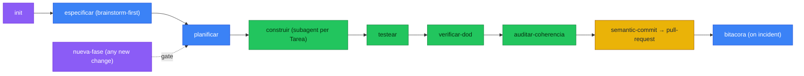

# project-suite — Design Spec

> Status: **draft for review** · Date: 2026-07-01 · Author: Hortifrut Analytics
> Sibling plugin: `research-suite`. This plugin is written in English; it generates project documentation in the language the user chooses.

## 0. Purpose

`project-suite` is a Claude Code plugin that **bootstraps and governs spec-driven projects**: plan in documents first, build in phases, with enforced quality gates (semantic commits, pull requests, mandatory tests, incident log, doc↔code coherence).

It packages a documentation method (7 chained templates) plus the skills to author those docs, close the build loop, and enforce the workflow via a generated `CLAUDE.md`/`AGENTS.md` in each target project.

**Non-goals:** it is not a code generator, not a CI service, not language-specific. It scaffolds and governs; the human/agent still writes the code.

### 0.1 Relationship to superpowers

`project-suite` is a domain-specific, **document-anchored** version of the superpowers dev workflow. It adapts (not copies) several superpowers process skills, tuned to our 7-template docs, our Spanish/English output, and `docs/` as the source of truth:

| superpowers skill | project-suite counterpart |
|---|---|
| `brainstorming` | `especificar` opens with its discipline (one question at a time, propose approaches, approval gate) feeding the templates' "Preguntas de diseño" |
| `writing-plans` | `planificar` (Fases → Sub fases → Tareas, our IDs + mandatory tests) |
| `subagent-driven-development` / `executing-plans` | `construir` (chains each Fase/Tarea through subagents) |
| `test-driven-development` | `testear` (authors + runs the mandated test tiers) |
| `verification-before-completion` | `verificar-dod` (Definition-of-Done gate before `[X]`) |

Other superpowers skills (`systematic-debugging`, `requesting-code-review`) stay available as-is; we do not fork what we don't need to retune.

## 1. Naming & location

- **Name:** `project-suite`
- **Repo:** `C:\Users\aprieto\Github\project-suite`
- **Marketplace:** self-hosted local marketplace (same pattern as `research-suite`).

## 2. Language handling

- `plugin.json` → `userConfig.default_doc_language` (`es | en`), **asked at install** (literal requirement). Default `es`.
- The `init` command **reconfirms per project** — doc language is more natural per-project than global.
- **Plugin content** (SKILL.md, commands, generated `CLAUDE.md` template) is written in **English**.
- **Generated project docs** are written in the chosen language.
- Bilingual docs are achievable by running a doc skill twice (one per language); the plugin does not auto-maintain two mirrored copies of every doc (avoids 14-file sync burden). This can be revisited if a real need appears.

## 3. Target-project `docs/` structure

Documents live **in the repo where the agent runs** (never a global root), under `docs/` with **per-domain subfolders**. This is not cosmetic: the templates already cross-reference these exact paths, so a flat layout would break their internal links.

```
docs/
├── description_proyecto.md      # single source of truth (what the system does)
├── ejecucion.md                 # run/deploy guide
├── architecture/architecture.md # data-flow architecture (C4 + Mermaid + ADRs)
├── db/diseno_db.md              # data model per database
├── plan/plan_maestro.md         # Fases → Sub fases → Tareas (+ plan_*.md for initiatives)
├── task/tareas.md               # derived Kanban (IDs, checkboxes, tests)
├── logs/log.md                  # incident logbook
└── superpowers/specs/           # design specs (this file lives here in the plugin repo)
```

- **`.gitignore`:** controlled by `userConfig.version_working_files` (`no | yes`, default `no`), reconfirmed per project in `init` like the language. **Working files** — `docs/task/`, `docs/plan/`, `docs/logs/`, `CLAUDE.md`, `AGENTS.md` — are gitignored by default (local, never committed unless the user opts in). The **shareable spec** — `docs/description_proyecto.md`, `docs/architecture/`, `docs/db/`, `docs/ejecucion.md` — is always committed. Rationale: the task board, plan, incident log and per-tool agent-rule files are working/local state; the spec is the shareable contract. Tradeoff: for team work you may want the plan and rules versioned too — set `version_working_files: yes`. If files were already tracked and become ignored, `init` runs `git rm --cached` to untrack without deleting.

## 4. Plugin repo layout

```
project-suite/
├── .claude-plugin/
│   ├── plugin.json          # userConfig.default_doc_language, name, version
│   └── marketplace.json
├── .mcp.json                # bundled MCP servers (codegraphcontext) — see §11
├── commands/
│   ├── init.md              # scaffold new project
│   └── nueva-fase.md        # spec-driven change gate
├── skills/
│   ├── especificar/         # description_proyecto + architecture + diseno_db
│   ├── planificar/          # plan_maestro + tareas
│   ├── bitacora/            # log.md
│   ├── ejecucion/           # ejecucion.md
│   ├── testear/             # author + run unit + user-simulation tests
│   ├── verificar-dod/       # Definition-of-Done gate per Tarea
│   ├── auditar-coherencia/  # doc↔code drift audit
│   ├── construir/           # execute plan phases via subagents (adapts subagent-driven-development)
│   ├── rust-standards/      # NEW
│   ├── astro-standards/     # NEW
│   ├── sql-standards/       # NEW
│   ├── ts-standards/        # NEW
│   ├── webapp-standards/    # NEW (SPA/relative-paths/uv+pnpm lessons, reusable)
│   ├── generar-diagramas/   # bundled copy
│   ├── semantic-commit/     # bundled copy
│   ├── pull-request/        # bundled copy
│   ├── caveman/             # bundled copy
│   ├── python-standards/    # bundled copy
│   └── r-standards/         # bundled copy
├── templates/               # the 7 plantilla_*.md as canonical structure exemplars
│   ├── plantilla_description_proyecto.md
│   ├── plantilla_architecture.md
│   ├── plantilla_db.md
│   ├── plantilla_plan.md
│   ├── plantilla_tareas.md
│   ├── plantilla_ejecucion.md
│   └── plantilla_log.md
└── README.md
```

Templates are packaged once as **structure exemplars**; skills read the relevant template and generate the real doc in the target language following that structure (no bilingual template duplication).

## 5. Commands

### 5.1 `init` — scaffold a spec-driven project
1. Confirm doc language (default from `userConfig`).
2. Ask which enforcement file(s) to generate: `CLAUDE.md`, `AGENTS.md`, or both (default both).
3. Design interview (the design questions from `plantilla_description_proyecto`): system type, problem, components, data flows, business rules, UI.
4. Generate `docs/` tree from templates in the chosen language (skip sections that don't apply — e.g. no UI → no §6).
5. Generate enforcement file(s) — see §7.
6. Generate `.gitignore` (language-appropriate). By default (`version_working_files: no`) gitignore the working files (`docs/task/`, `docs/plan/`, `docs/logs/`, `CLAUDE.md`, `AGENTS.md`); keep the shareable spec committed. `git rm --cached` any that were already tracked.
7. Offer `git init` + first semantic commit (via `semantic-commit`).

### 5.2 `nueva-fase` — spec-driven change gate
The core "plan first" enforcement. On any requested change/feature:
1. Read `plan/plan_maestro.md` + `task/tareas.md`.
2. Decide: fits an existing Fase, or needs a **new Fase**?
3. If new: draft Fase (macro-objective, deliverable, AC, test strategy) + Sub fases + Tareas (with 🧠 explanation + 💡 runnable-example blocks) into `plan_maestro.md` and `tareas.md`.
4. **Stop before coding.** The written plan is the gate; implementation only starts once the plan exists.

## 6. Skills

### 6.1 Core doc skills (grouped, per user's choice)
- **`especificar`** → `description_proyecto.md` + `architecture/architecture.md` + `db/diseno_db.md`. Opens with a brainstorming discipline **adapted from `superpowers:brainstorming`** (one question at a time, propose 2–3 approaches, approval gate) that feeds the templates' "Preguntas de diseño"; its terminal state is the written spec docs, not a generic design doc. Uses `generar-diagramas` for Mermaid with the canonical palette.
- **`planificar`** → `plan/plan_maestro.md` + `task/tareas.md`. Enforces Fases→Sub fases→Tareas→Acciones IDs, mandatory unit + user-simulation tests, 🧠+💡 blocks, Definition of Done.
- **`bitacora`** → appends incidents to `logs/log.md` (symptom → hypothesis → root cause → resolution → verification → lessons; reverse-chronological).
- **`ejecucion`** → `ejecucion.md` (project-type selector, env setup, run, deploy, troubleshooting).

### 6.2 Loop-closer skills (fill the gaps the investigation found)
- **`testear`** — reads a Tarea/Sub fase's test blocks + Golden Data, detects the stack runner (pytest/Jest/Vitest/testthat/cargo test) and E2E tool (Playwright), writes test files into `tests/unit|integration|e2e`, runs them, reports pass/fail per Acceptance Criterion.
- **`verificar-dod`** — Definition-of-Done gate for one Tarea by ID: runs declared tests (+ coverage vs reference threshold), runs linter/formatter with zero warnings, confirms DB-schema/env-var changes are reflected in `diseno_db.md`/`.env.example`/`architecture.md`. Reports pass/fail per DoD item before `[X]`/commit. Composes with `testear`.
- **`auditar-coherencia`** — diffs `architecture.md` (flows, ADRs, per-flow script paths, deployment bundle) and `diseno_db.md` (ER, column dictionary, PK meanings, write policies, CRUD matrix) against real code (migrations/DDL, ORM models, repository read/write functions); emits a ranked drift report.

### 6.3 Execution skill
- **`construir`** — **adapts `superpowers:subagent-driven-development`**. Reads `plan/plan_maestro.md` + `task/tareas.md` and drives implementation phase by phase: for each Fase → Sub fase → Tarea it dispatches a **subagent** that implements the Tarea per the applicable `*-standards`, then runs `testear` and `verificar-dod`, and only on green updates the `tareas.md` checkbox (respecting the roll-up invariant). Phases chain through subagents so the main context stays clean. Stops on a red gate and reports.

### 6.4 Language-standards skills
New: **`rust-standards`, `astro-standards`, `sql-standards`, `ts-standards`, `webapp-standards`** — each mirrors the existing `python-standards`/`r-standards` structure (architecture, naming, docs, testing). `webapp-standards` distills the `replication_app_astro_shiny` lessons (SPA-only for ShinyApps-style deploy, strictly relative paths, inline CSS, `uv`+`pnpm`, consolidated API endpoints, vectorized pandas) as a reusable standard — not a template.

### 6.5 Bundled skills (copied for a self-contained plugin)
`generar-diagramas`, `semantic-commit`, `pull-request`, `caveman`, `python-standards`, `r-standards`.

## 7. Generated `CLAUDE.md` / `AGENTS.md`

`init` generates **`CLAUDE.md` as canonical** (all hard rules) and **`AGENTS.md` as a one-line pointer** to it, so different agents read their own file with no divergent source of truth. If the user wants only one, `init` generates only that one.

Hard rules embedded:
1. Read `docs/` before working; plan in documents first.
2. New change → evaluate a **new Fase** with `nueva-fase` before writing code.
3. **Strict** use of `semantic-commit` for every commit and `pull-request` for every PR.
4. Per-file-type standard: `.py`→python, `.R`→r, `.rs`→rust, `.astro`→astro, `.sql`→sql, `.ts`→ts, web apps→webapp.
5. Every Tarea needs unit + user-simulation tests; close it with `verificar-dod` before marking `[X]`.
6. Consult/record incidents in `docs/logs/log.md` (`bitacora`).
7. Diagrams via `generar-diagramas` (Mermaid, canonical palette).

## 8. The spec-driven loop (how it fits)



## 9. Backlog (deferred, not v1)

Ranked; the first two are the likely v1.1 additions because the plan mentions them explicitly:
1. **`calidad-setup`** — wire linters/formatters/pre-commit + CI per repo (plan Fase 0 / T0.2.1).
2. **`migrar-db`** — author + verify reversible migrations from `diseno_db.md` (plan Fase 2).
3. `depurar` — drive the log.md diagnostic loop (overlaps `superpowers:systematic-debugging`).
4. `bootstrap-entorno` — take a fresh clone to a verified running env.
5. `auditar-dependencias` — supply-chain/secret/SAST scan.
6. `generar-readme` — derive repo README from the 7 docs.
7. `sincronizar-tareas` — reconcile `tareas.md` checkboxes against real repo state.

Rejected as duplicates/redundant: `generar-tests`, `migracion-db`, `cobertura-gate`, `ci-pipeline`, `propagar-cambio-doc`, `scaffold-modulo`.

## 10. Open questions

- None blocking. `both`-language bilingual docs are out of scope for v1 (achievable by re-running a skill per language).

## 11. MCP servers

The plugin ships a `.mcp.json` so its MCP servers install/register when the plugin is enabled.

### 11.1 Bundled by default
- **`codegraphcontext`** — indexes the local codebase into a graph DB to give a project-wide structural overview (feeds `especificar`/`auditar-coherencia` and general navigation). Embedded backend, no API key.
  ```json
  {
    "mcpServers": {
      "codegraphcontext": {
        "type": "stdio",
        "command": "uvx",
        "args": ["--with", "kuzu", "codegraphcontext", "mcp", "start"]
      }
    }
  }
  ```
  Install: `uvx` fetches `codegraphcontext` + `kuzu` on first launch (no manual pip). **Windows caveat:** the default FalkorDB Lite backend is Unix-only; bundling `--with kuzu` makes KuzuDB (Windows-native, Python 3.12+) available so it falls back to it. If auto-detection doesn't pick KuzuDB, run once: `codegraphcontext config db` → KuzuDB. Documented in `ejecucion`/README.

### 11.2 Opt-in, added per project by `init` (NOT plugin-global)
- **`playwright`** (`npx -y @playwright/mcp@latest`) — drives the mandated **user-simulation / E2E** test tier for web/UI projects (`testear`). Not bundled plugin-wide because it pulls browser binaries (~hundreds of MB) and most non-web projects don't need it. When `init` detects a web/UI project type, it writes a **project-level `.mcp.json`** in the target repo with this server.

### 11.3 Deliberately NOT bundled
- **`context7`** — the user already runs a single global HTTP+key context7 server. Bundling a second definition inside a plugin is exactly what previously caused connect/disconnect churn (documented incident: three competing context7 definitions, including a plugin one). Standards/spec skills may *use* the global context7 to verify current library APIs, but the plugin must not define its own. Keep one context7 server.
- **GitHub / database / memory MCPs** — `gh` CLI already covers PR/issue flows; DB access is project-specific (introspect via the project's own `.mcp.json` or `sqlite3`/`psql` CLIs in `auditar-coherencia`); memory/sequential-thinking are speculative. YAGNI for v1.
