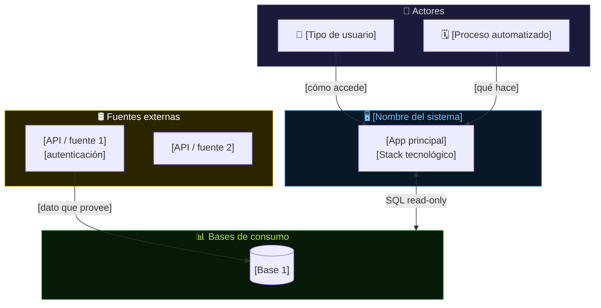
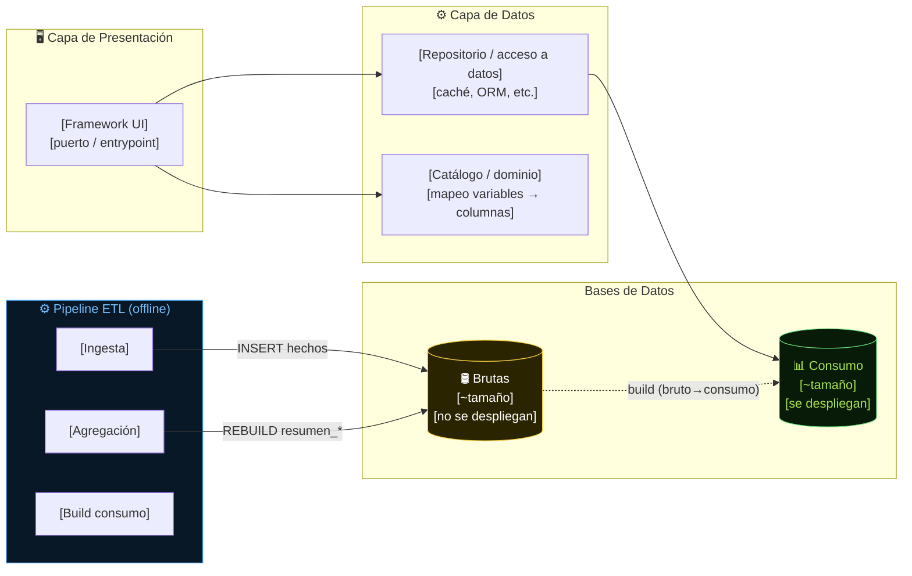
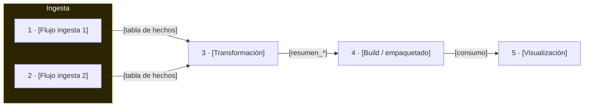
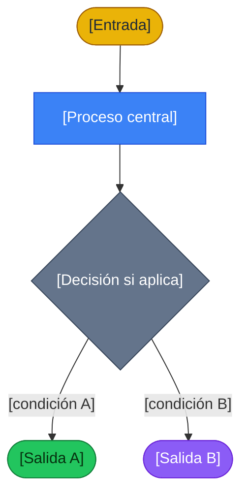
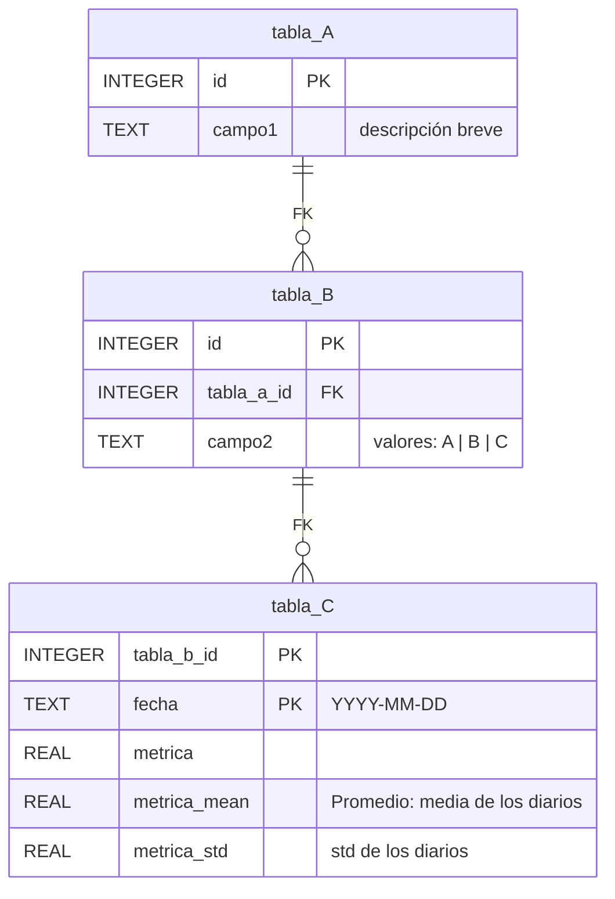
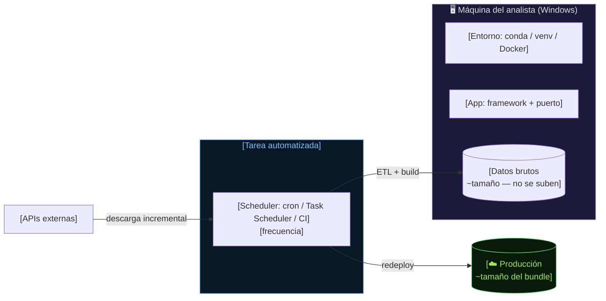

# Plantilla — Documento de Arquitectura (app_estaciones_chile)

> **Uso:** copia este archivo a `docs/architecture/` con el nombre apropiado, completa los placeholders `[...]` y elimina las instrucciones en cursiva. El modelo canónico completo es [`docs/architecture/architecture.md`](../architecture/architecture.md) — úsalo como referencia y ejemplo vivo.
>
> **Estructura:** el documento se organiza por **Flujos de datos** (cómo fluye el dato desde las APIs hasta el gráfico), no por fases de desarrollo. Las fases viven en `docs/task/tareas.md`.

---

## Preguntas de diseño — respóndelas antes de escribir

> *Antes de crear cualquier sección o diagrama, responde estas preguntas. Si no puedes contestarlas, falta información o el análisis no está listo. El documento es la respuesta sistematizada a estas preguntas.*

### ¿Quiénes son los actores y los sistemas externos?

- ¿Quién **usa** el sistema? (personas, roles: analista, admin, automatización)
- ¿Qué **APIs / fuentes externas** proveen datos? (nombre, autenticación, protocolo)
- ¿Qué **sistemas externos** consume o notifica el sistema? (nube, scheduler, email)
- ¿El sistema tiene **múltiples entornos** (local / deploy / staging)?

> *Si hay más de 8 actores+sistemas, agrúpalos. El C4 Contexto no debe tener más de 8 nodos.*

### ¿Cuántas capas tiene el sistema y qué hace cada una?

- ¿Hay una **capa de presentación** (UI, API REST, CLI)?
- ¿Hay una **capa de acceso a datos** (repositorios, ORM, cache)?
- ¿Hay un **pipeline ETL** o proceso batch separado de la UI?
- ¿Cuándo **leen** los componentes y cuándo **escriben**? ¿Son read-only en producción?

> *Esta respuesta arma el C4 Contenedor (§2). Cada capa = un subgrafo.*

### ¿Cuántos flujos de datos hay?

Un **Flujo** es una transformación que tiene entrada clara, proceso definido y salida identificable. Para identificarlos, pregunta:

1. **¿De dónde viene el dato original?** (API, formulario web, archivo, proceso interno)
   - Cada fuente externa distinta = un Flujo de ingesta separado.
2. **¿Qué transforma el dato?** (agrega, filtra, re-keya, fusiona, calcula índices)
   - Cada transformación que produce una tabla/archivo nuevo = un Flujo.
3. **¿Dónde termina el dato?** (tabla SQLite, archivo CSV, pantalla, API destino)
   - Si el mismo dato pasa por 2 transformaciones secuenciales → 2 Flujos encadenados.
4. **¿Hay procesos de orquestación o automatización?** (scheduler, CI/CD, tarea Windows)
   - La orquestación que encadena otros flujos = un Flujo propio (automatización).
5. **¿Hay una capa de presentación / visualización?**
   - El consumo del dato por la UI = el último Flujo (visualización).

> *Regla práctica: un sistema con 3 fuentes externas, 1 agregación, 1 unificación, 1 especializado, 1 build y 1 UI tiene ~8–9 flujos. Menos de 3 flujos → probablemente hay flujos implícitos que no se distinguieron.*

**Checklist de flujos comunes:**

| ¿Existe en este sistema? | Tipo de Flujo | Señal de que existe |
|---|---|---|
| [ ] | Ingesta por fuente | Hay una API / scraping / CSV que descarga datos |
| [ ] | Validación / dedup | Hay un paso que comprueba integridad o elimina duplicados |
| [ ] | Agregación / cálculo de índices | Los datos crudos se resumen por periodo (diario, semanal) |
| [ ] | Unificación / fusión de fuentes | Dos o más fuentes se mezclan en una sola vista de negocio |
| [ ] | Build / empaquetado | Las bases brutas se recortan en bases de consumo para deploy |
| [ ] | Automatización / orquestación | Un scheduler encadena los flujos anteriores |
| [ ] | Visualización / consumo UI | La app lee las bases de consumo y las presenta |
| [ ] | Dominio especializado | Hay un subdominio separado (pronóstico, alertas, exportación) |

### ¿Qué tipo de diagrama describe mejor cada flujo?

| Si el flujo describe… | Usa este diagrama |
|---|---|
| Pasos de un proceso, decisiones, bifurcaciones | `flowchart` |
| Intercambio de mensajes entre actores en el tiempo | `sequenceDiagram` |
| Tablas de BD y sus relaciones | `erDiagram` |
| Transiciones entre estados de un objeto | `stateDiagram-v2` |
| Un flujo con API externa (quién llama, quién responde) | `sequenceDiagram` |
| Un pipeline ETL con transformaciones | `flowchart` |
| La estructura de datos que produce el flujo | `erDiagram` |
| Varios ángulos del mismo flujo | combina: p. ej. `sequenceDiagram` + `erDiagram` |

### ¿Cuáles son las invariantes y reglas críticas del sistema?

- ¿Qué **nunca** debe ocurrir? (borrar datos crudos, re-descargar el histórico completo, duplicar sin control)
- ¿Qué datos son **fuente de la verdad** y cuáles son derivados regenerables?
- ¿Qué invariantes debe preservar el pipeline? (unicidad de PK, rangos de horas ≤ 24/día, solo datos verificados en resúmenes)
- ¿Qué restricciones impone la infraestructura? (rate-limit de APIs, AppLocker, tamaño de bundle)

> *Una invariante por flujo es obligatoria. Sin invariantes documentadas, la arquitectura no describe comportamiento — describe estructura.*

### ¿Cuáles son las decisiones arquitectónicas no obvias?

Para cada decisión tomada, pregunta: *"¿Cuestionaría esto un desarrollador nuevo?"*

- ¿Por qué este motor de BD y no otro? (SQLite vs. Postgres, archivo local vs. servidor)
- ¿Por qué este modelo de datos y no el más evidente? (CodigoNacional virtual, re-keying por productor, schema homogéneo con NULLs)
- ¿Por qué esta estrategia de actualización? (incremental vs. full-refresh, INSERT OR REPLACE vs. INSERT OR IGNORE)
- ¿Por qué esta separación? (brutas vs. consumo, 3 fuentes → 2 fuentes en UI)
- ¿Qué alternativas se descartaron y por qué?

> *Si la justificación es obvia ("SQLite porque es fácil"), no es un ADR útil. Un ADR útil es el que salvaría una discusión de 30 minutos en code review.*

---

## 1. Visión General del Sistema (C4 – Nivel Contexto)

> *Quiénes interactúan con el sistema y desde dónde. Usa `flowchart TB`. Máximo 8 nodos. Incluye actores humanos, sistemas externos y el sistema central.*
>
> *Antes de dibujarlo, responde: ¿quién usa el sistema? ¿qué APIs alimentan el dato? ¿qué sistema lo sirve en producción?*

**Decisiones arquitectónicas clave (Nivel Macro):**

> *Lista 3–5 decisiones fundacionales. Estructura: "Se eligió X porque Y. Se descartó Z porque W."*
> - Motor de persistencia: [...]
> - Separación UI ↔ datos: [...]
> - Modelo de datos: [...]
> - Estrategia de despliegue: [...]

---

## 2. Componentes Internos (C4 – Nivel Contenedor)

> *Qué módulos/procesos existen y cómo se comunican. Usa `flowchart LR`.*
>
> *Antes de dibujarlo, responde: ¿cuántas capas tiene el sistema? ¿qué componente lee y qué componente escribe? ¿hay separación entre el proceso de actualización y la app de lectura?*

**Flujo de una interacción típica (describe el camino del dato en runtime):**
1. [Paso 1: el usuario selecciona X]
2. [Paso 2: el componente Y resuelve Z]
3. [Paso 3: se consulta la tabla W y se devuelve el resultado]

**Flujo de actualización (describe el camino del dato en el ETL):**
1. [Paso 1: el proceso A ingesta en la tabla B]
2. [Paso 2: el proceso C agrega y recrea D]
3. [Paso 3: el build empaqueta E para deploy]

---

## 🔄 Flujos de datos — mapa maestro

> *Este es el índice que une el nivel macro (§1–§2) con los detalles (§3–§N).*
>
> *Antes de llenarlo, responde las preguntas de la sección "¿Cuántos flujos hay?" de arriba. Cada fila = una sección §3, §4, etc.*

| # | Flujo | Entrada | Proceso | Salida | Detalle |
|---|---|---|---|---|---|
| **1** | [Nombre] | [Origen del dato: API, archivo, otro flujo] | [Qué hace: descarga, agrega, fusiona, re-keya] | [Tabla / archivo destino] | §3 |
| **2** | [Nombre] | [Origen] | [Qué hace] | [Destino] | §4 |
| **N** | [Nombre] | [Origen] | [Qué hace] | [Destino] | §N+2 |

> **Regla de oro:** [describe aquí la regla de negocio central que une todos los flujos — qué determina qué archivo, tabla y columna se leen en runtime, o qué desencadena cada flujo]

---

## 3. Flujo 1 — [Nombre]

> *Sección por flujo. Estructura obligatoria:*
> - *Cabecera: "Entrada → Proceso → Salida" en una línea — si no puedes escribir esta línea en ≤ 20 palabras, el flujo está mal delimitado*
> - *Script(s) involucrados*
> - *Diagrama principal (ver tabla de elección en preguntas de diseño)*
> - *Reglas e invariantes del flujo*

**Entrada → Proceso → Salida:** [origen] → [proceso] → [destino].

Script: `[scripts/ruta/al/script.py]`.

### 3.1 [Diagrama principal — nombre describe qué muestra]

> *Pregunta de verificación: ¿el diagrama responde "qué pasa exactamente en este flujo" sin necesidad de leer el código? Si no, falta información o el diagrama no es el tipo correcto.*

> **Paleta canónica (aplícala siempre, legible en fondo claro y oscuro):**
>
> | `classDef` | Color | Rol |
> |---|---|---|
> | `fuente` | `#EAB308` amarillo | Datos de entrada / fuentes brutas |
> | `proc` | `#3B82F6` azul | Procesos ETL, transformaciones |
> | `model` | `#22C55E` verde | Salidas verificadas / modelos de datos |
> | `out` | `#8B5CF6` violeta | Salidas UI, presentación |
> | `riesgo` | `#EF4444` rojo | Errores, guardrails, restricciones |
> | `ui` | `#64748B` gris | Actores, UI, decisiones, elementos neutros |

### 3.2 Reglas e invariantes

> *Lista las restricciones de comportamiento de este flujo. Cada invariante debe poder verificarse.*

| Regla | Descripción |
|---|---|
| **[Nombre corto]** | [Descripción: qué se cumple siempre, qué nunca pasa, qué se verifica] |
| **[Nombre corto]** | [Ej: "No descarga si fecha ya existe: INSERT OR IGNORE garantiza idempotencia"] |

---

## 4. Flujo 2 — [Nombre]

*(repite estructura de §3)*

---

## [3+N-1]. Flujo N — [Nombre]

*(último flujo antes del modelo de datos)*

---

## [3+N]. Modelo de datos — Esquema lógico

> *Diagrama ER del esquema compartido entre fuentes (si aplica).*
>
> *Pregunta de verificación: ¿el ER muestra las cardinalidades reales (no "muchos a muchos" por descuido)? ¿Los tipos de dato son los SQLite reales (INTEGER, REAL, TEXT) y no tipos genéricos?*
>
> **El diccionario completo** (todas las columnas, tipos, valores permitidos) vive en [`docs/db/diseno_db.md`](../db/diseno_db.md) — no lo dupliques aquí; apunta a él.

**Significado de `[clave_principal]` por fuente:**

| Fuente / Base | `[clave]` significa |
|---|---|
| `[base_1.sqlite]` | [descripción precisa] |
| `[base_2.sqlite]` | [descripción precisa] |

---

## [3+N+1]. Arquitectura de despliegue

> *Dónde corre el sistema, cómo se despliega, qué entra al bundle.*
>
> *Pregunta de verificación: ¿el diagrama muestra claramente qué NO se sube (datos brutos, credenciales) y qué SÍ (consumo)? ¿Se ve la tarea/scheduler que orquesta la actualización?*

**Notas de despliegue:**
- **Bundle:** [qué entra — ej: `app.py`, `src/`, `data_deploy/` (~X MB)] · [qué se excluye — ej: `data/` cruda, `scripts/`, `docs/`]
- **Credenciales:** [cómo se manejan — ej: `.env` local, variables de entorno en el servidor]
- **Actualización automática:** [quién la dispara, con qué frecuencia, qué encadena]
- **Restricciones:** [AppLocker, rate-limit de APIs, límites de la plataforma de deploy]

---

## [3+N+2]. Decisiones arquitectónicas (ADRs)

> *Solo las decisiones que un desarrollador nuevo podría cuestionar o revertir sin entender el contexto. Si la decisión es obvia, no es un ADR.*
>
> *Pregunta de verificación: ¿cada fila salvaría ≥ 10 minutos de discusión en code review? Si no, no es un ADR útil.*

| Decisión Tomada | Alternativa Descartada | Razón Principal |
|---|---|---|
| [Qué se eligió: ser específico] | [Qué se podría haber hecho: ser específico] | [Por qué: la restricción real, no "es más simple"] |
| [Ej: SQLite por base, no una sola BD] | [Ej: Una sola BD con tablas prefijadas] | [Ej: Cada fuente tiene su propio ETL y ciclo de vida; mezclarlas crea dependencias de escritura innecesarias] |

---

## Guía rápida: qué va dónde

| Tipo de contenido | Archivo |
|---|---|
| Historia de construcción por fase / sprint | `docs/task/tareas.md` |
| Flujos de datos y arquitectura viva | `docs/architecture/architecture.md` |
| Diccionario completo de columnas de BD | `docs/db/diseno_db.md` |
| Incidentes, diagnósticos, refactors | `docs/logs/log.md` |
| Plan de iniciativa (pronóstico, unificación, etc.) | `docs/plan/plan_*.md` |
| Guía de ejecución paso a paso | `ejecucion.md` / `README.md` |

**❌ No va en architecture.md:**
- Listado de tareas pendientes → `tareas.md`
- Instrucciones de instalación paso a paso → `ejecucion.md`
- Diccionario completo de columnas → `diseno_db.md`
- Historia de fases: "Fase 13 — completado en junio 2026" → `tareas.md`
- Código de producción → `src/` y `scripts/`

## Checklist antes de publicar

**Nivel Contexto y Contenedor:**
- [ ] §1: C4 Contexto con ≤8 nodos, flechas anotadas con el dato que cruza
- [ ] §2: C4 Contenedor con capas UI / Datos / ETL diferenciadas
- [ ] §2: Flujo de interacción típica (runtime) + flujo de actualización (ETL) descritos en prosa

**Mapa de flujos:**
- [ ] Tabla de flujos completa y coherente con §3–§N (los números de sección cuadran)
- [ ] Cada flujo tiene cabecera "Entrada → Proceso → Salida" expresable en ≤ 20 palabras
- [ ] El diagrama de mapa muestra encadenamiento real entre flujos

**Secciones de flujo:**
- [ ] Script referenciado en cada sección
- [ ] Diagrama del tipo correcto para lo que se quiere comunicar (no siempre `flowchart`)
- [ ] Paleta canónica aplicada en todos los diagramas con `classDef`
- [ ] Al menos una regla/invariante por flujo

**Modelo de datos:**
- [ ] ER con cardinalidades correctas (`||--o{`, `}o--||`, etc.)
- [ ] Tipos SQLite reales (INTEGER, REAL, TEXT) — no tipos genéricos
- [ ] Apunta a `diseno_db.md` para el diccionario completo

**Cierre:**
- [ ] ADRs: ≥3 decisiones con alternativa descartada y razón concreta
- [ ] Despliegue: qué entra al bundle, qué queda fuera, quién automatiza
- [ ] Sin secciones organizadas por fase de desarrollo
