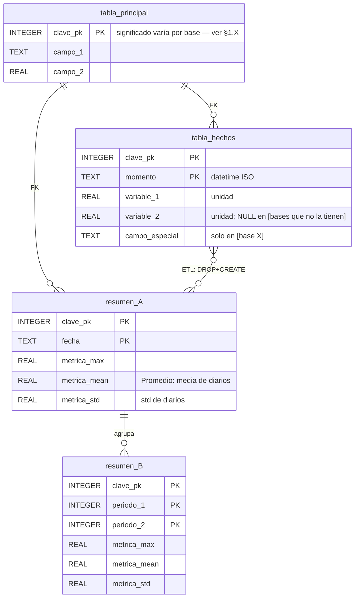
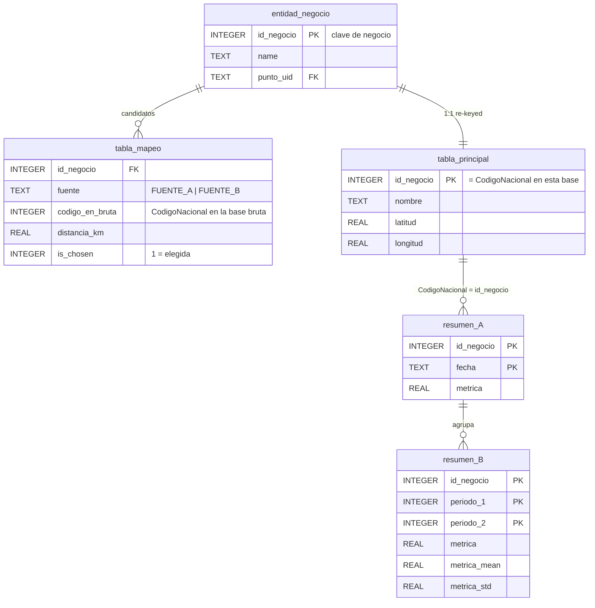

# Plantilla — Diseño de Bases de Datos (app_estaciones_chile)

> **Uso:** copia este archivo a `docs/db/` con el nombre apropiado, completa los placeholders `[...]` y elimina las instrucciones en cursiva. El modelo canónico completo es [`docs/db/diseno_db.md`](../db/diseno_db.md) — úsalo como referencia y ejemplo vivo.
>
> **Estructura:** el documento se organiza por **bases de datos** (una sección por base), no por fases de desarrollo. Empieza siempre por el mapa de bases y el esquema lógico compartido (si aplica); luego dedica una sección a cada base con sus particularidades y diccionario de columnas.

---

## Preguntas de diseño — respóndelas antes de escribir

> *Antes de crear una sección, responde estas preguntas. Si no puedes contestarlas, falta información para documentar. El documento debe ser la respuesta sistematizada a estas preguntas.*

### ¿Cuántas bases de datos hay y de qué tipo son?

- **Brutas:** ¿Qué bases guardan datos crudos (series temporales, observaciones, registros sin procesar)?
- **Consumo:** ¿Qué bases son derivadas (resúmenes, re-keyed, pre-calculadas) y son las únicas que lee la app?
- **Especializadas:** ¿Hay bases de dominio separado (pronóstico, catálogos, logs)?

> *Ejemplo: 3 brutas (~1 GB, no se despliegan) + 2 consumo (~12 MB, sí se despliegan) + 1 pronóstico (~2 MB, consumo).*

### ¿Las bases comparten esquema lógico?

- ¿Tienen las mismas tablas con el mismo significado?
- ¿O el esquema varía por fuente y hay que documentar cada una por separado?
- Si comparten esquema: ¿dónde difieren? (columnas NULL, significado de PK, granularidad temporal)

> *Si comparten esquema → escribe §1 "Esquema lógico compartido" con el ER genérico y una tabla de diferencias. Si no → cada base va directamente a su sección con su propio ER.*

### ¿Cuál es la política de escritura de cada tabla?

- ¿`INSERT OR IGNORE`, `INSERT OR REPLACE`, `UPSERT`, `DROP + CREATE`?
- ¿Quién escribe (qué script)?
- ¿Con qué frecuencia (diario, por corrida, manual)?

> *Esta respuesta determina la sección "Políticas de escritura" de cada base.*

### ¿Cuál es la clave primaria real de cada tabla y qué significa?

- ¿La PK es técnica (autoincremento) o natural (código de estación, fecha)?
- ¿El mismo campo tiene significados distintos en bases distintas?

> *Ejemplo: `CodigoNacional` es código MeteoChile en DMC, código virtual lat/lon en Open-Meteo, y `productor_id` en las bases de consumo — tres significados, mismo nombre.*

### ¿Qué columnas existen en todas las bases pero pueden ser NULL en algunas?

- ¿Por qué existen si son NULL? ¿Es intencional (esquema homogéneo para la UI) o un error?
- Si es intencional, documéntalo explícitamente y crea una **matriz de fuentes vs. columnas especiales** al final.

### ¿Qué bases se despliegan y cuáles no?

- ¿Cuál es el tamaño de cada base?
- ¿Qué se excluye del deploy (datos brutos, tablas intermedias, ema_obs)?
- ¿Qué se incluye (solo resumen_*, metadatos, catálogos)?

---

## Mapa de bases de datos

> *Una fila por base. Tamaños aproximados, tipo y descripción. Aclara qué se despliega y qué no.*

| Archivo | Tipo | Descripción | Tamaño aprox. | ¿Se despliega? |
|---|---|---|---|---|
| `data/[fuente]/[nombre].sqlite` | Bruta | [Qué contiene] | ~[X] MB/GB | No |
| `data/[fuente]/[nombre_consumo].sqlite` | Consumo | [Qué contiene] | ~[X] MB | Sí |

Las bases de **consumo** son las únicas que se despliegan (`data_deploy/`). Las brutas solo viven en la máquina del analista.

---

## 1. Esquema lógico compartido (si aplica)

> *Si varias bases comparten el mismo esquema, documenta aquí el ER genérico y la tabla de diferencias. Si cada base tiene un esquema muy distinto, salta esta sección y ve directamente a §2, §3, etc.*

### 1.1 Diagrama ER — esquema compartido

> **Convenciones en el ER:**
> - `PK` = parte de la clave primaria
> - `FK` = clave foránea (relación)
> - Tipos SQLite: `INTEGER`, `REAL`, `TEXT`, `BLOB`
> - Poner en el campo el valor permitido o restricción: `"solo archive | forecast"`, `"YYYY-MM-DD"`, `"≥ 0"`
> - Columnas `_mean` y `_std` en tablas de resumen semanal/mensual: siempre indicar qué agregan (media/std de los valores diarios)

### 1.2 Políticas de escritura

| Tabla | Política | Quién escribe | Con qué frecuencia |
|---|---|---|---|
| `tabla_principal` | `INSERT OR IGNORE` / `UPSERT` | `[script.py]` | Al inicializar / actualizar metadatos |
| `tabla_hechos` | `INSERT OR IGNORE` (fuentes A/B) / `INSERT OR REPLACE` (fuente C: re-taggea campo) | `[script.py]` | Por corrida incremental |
| `resumen_*` | `DROP TABLE + CREATE TABLE AS SELECT` | `[script_agg.py]` | Por corrida — regenera siempre |

> **Regla crítica:** si `tabla_hechos` es la fuente de la verdad (datos crudos observados), **NUNCA se elimina**. Las tablas `resumen_*` son derivadas regenerables.

### 1.3 Duplicados lógicos esperados (si aplica)

> *Describe si la PK puede tener duplicados lógicos y por qué. Explica cómo se neutralizan en la agregación.*

### 1.4 Campos especiales por fuente

> *Columna o campo que solo tiene sentido / valor en alguna fuente. Ejemplo: columna `origen` solo en Open-Meteo.*

| Campo / Columna | Solo en | Valores | Efecto en resumen |
|---|---|---|---|
| `[campo]` | `[base X]` | `[val_a]` \| `[val_b]` | [Se incluye / se excluye / re-taggea] |

### 1.5 Significado de la clave primaria por base

| Fuente / Base | `[clave]` significa | Tipo |
|---|---|---|
| `[base_1.sqlite]` | [descripción precisa] | `INTEGER` / `TEXT` |
| `[base_2.sqlite]` | [descripción precisa] | `INTEGER` / `TEXT` |
| `[consumo.sqlite]` | [descripción: clave de negocio, id de productor, etc.] | `INTEGER` |

---

## 2. Base [Nombre] — `data/[fuente]/[archivo].sqlite`

> *Una sección por base de datos. Estructura:*
> - *Origen: de dónde vienen los datos (API, formulario web, proceso local...)*
> - *Particularidades: qué la hace diferente del esquema compartido*
> - *Columnas clave: diccionario de la tabla más importante / la que más difiere*
> - *Si es una base de consumo (re-keyed, re-estructurada): incluye su propio ER*

**Origen:** [API / scraping / derivación de otras bases]. [Frecuencia de actualización]. [Nº de entidades / puntos / estaciones].

### 2.1 Particularidades

> *Responde: ¿qué tiene esta base que las otras no tienen? ¿Qué columnas son NULL? ¿Qué columnas extra tiene? ¿Qué transformaciones aplica antes de insertar?*

- **Granularidad temporal de `tabla_hechos`:** [cada X minutos / horario / diario]
- **Columnas ausentes (siempre NULL):** `[col_a]`, `[col_b]` — [razón: sin sensores, fuente no lo provee, etc.]
- **Columnas extra en `tabla_principal`:** [col_extra_1], [col_extra_2]
- **Transformaciones:** [conversión de unidades, filtros de validez, etc.]

### 2.2 Columnas clave de `[tabla_principal / tabla_hechos]`

| Columna | Tipo SQLite | Unidad / Valores | Notas |
|---|---|---|---|
| `[col_pk]` | `INTEGER` | — | PK parte 1 |
| `[col_pk2]` | `TEXT` | datetime ISO | PK parte 2 |
| `[variable_1]` | `REAL` | [unidad] | [descripción] |
| `[variable_2]` | `REAL` | [unidad] | NULL en [condición] |
| `[campo_especial]` | `TEXT` | `[val_a]` \| `[val_b]` | Solo en esta base |

---

## 3. Base [Nombre] — `data/[fuente]/[archivo].sqlite`

*(repite estructura de §2)*

---

## [N]. Bases de consumo — [archivos de consumo]

> *Si varias bases de consumo tienen la misma estructura, documéntalas en una sola sección. Si difieren significativamente, una sección por base.*
>
> **Cuándo una base es "de consumo":** cuando su contenido es una re-proyección (re-keying, selección de columnas, cambio de clave de negocio) de las bases brutas para optimizar la lectura de la app. Solo `resumen_*` y metadatos; sin `ema_obs` / datos crudos.

### N.1 Diagrama ER — base de consumo

> *Si la base de consumo tiene un modelo de datos distinto (p. ej. tablas de mapeo productor ↔ estación), inclúyelo aquí con su ER específico.*

### N.2 Columnas clave del modelo de negocio

> *Documenta las tablas de mapeo / modelo que son exclusivas de esta base de consumo y no existen en las brutas.*

#### `[tabla_negocio]` — [descripción]

| Columna | Tipo | Descripción |
|---|---|---|
| `[id_negocio]` | `INTEGER` | PK — clave de negocio |
| `[campo_1]` | `TEXT` | [descripción] |
| `[punto_uid]` | `TEXT` | FK → `[tabla_ref]` |

#### `[tabla_mapeo]` — [descripción]

| Columna | Tipo | Valores permitidos | Descripción |
|---|---|---|---|
| `[id_negocio]` | `INTEGER` | — | FK |
| `[fuente]` | `TEXT` | `FUENTE_A` \| `FUENTE_B` | De qué base bruta viene la candidata |
| `[distancia]` | `REAL` | ≥ 0 | Distancia métrica (Haversine, etc.) |
| `[is_chosen]` | `INTEGER` | `0` \| `1` | `1` = elegida para este registro de negocio |

### N.3 Acceso CRUD por componente

| Tabla | Escritor (ETL) | Lector (App) | Sube al deploy |
|---|---|---|---|
| `[tabla_crudos]` | `[script.py]` (INSERT OR IGNORE) | — | **No** |
| `[resumen_*]` | `[script_agg.py]` (REBUILD) | `[función del repositorio]` | **Sí** |
| `[tabla_meta]` | `[script.py]` | `[función del repositorio]` | **Sí** |

---

## [N+1]. Matriz de fuentes vs. columnas especiales

> *Tabla final que resume qué columnas tienen valor real en cada fuente y cuáles son NULL. Útil cuando el esquema es homogéneo pero el relleno varía. Si no aplica (cada base tiene su propio esquema), omite esta sección.*

| Columna `[resumen_*]` | Fuente A | Fuente B | Fuente C |
|---|---|---|---|
| `[col_1]` | [valor real / descripción] | NULL | NULL |
| `[col_2]` | NULL | [valor real] | [valor real] |
| `[col_3]` | NULL | NULL | [proviene de variable X] |

> El esquema homogéneo es intencional: la UI nunca recibe error al cambiar de fuente — la columna siempre existe, puede ser NULL.

---

## Checklist antes de publicar

- [ ] Mapa de bases: todas las bases listadas con tamaño y flag "¿se despliega?"
- [ ] Si hay esquema compartido: ER genérico en §1 con tipos SQLite reales y cardinalidades correctas (`||--o{`, etc.)
- [ ] Tabla "Significado de clave primaria por fuente" completa
- [ ] Políticas de escritura por tabla: qué script, qué estrategia, con qué frecuencia
- [ ] Una sección por base con particularidades (columnas NULL, transformaciones)
- [ ] Diccionario de columnas de la tabla más importante de cada base
- [ ] Bases de consumo: ER propio si tienen tablas de mapeo o modelo de negocio
- [ ] Acceso CRUD por componente para bases de consumo
- [ ] Matriz de fuentes vs. columnas especiales (si el esquema es homogéneo con NULLs selectivos)
- [ ] Sin menciones de fases de desarrollo como estructura ("Fase 11 — completado")
- [ ] Apunta a `docs/architecture/architecture.md` para el flujo que genera cada base
