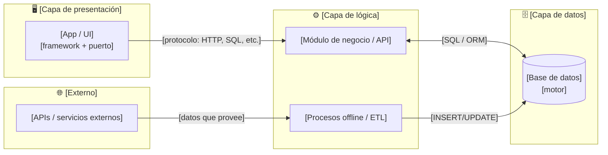
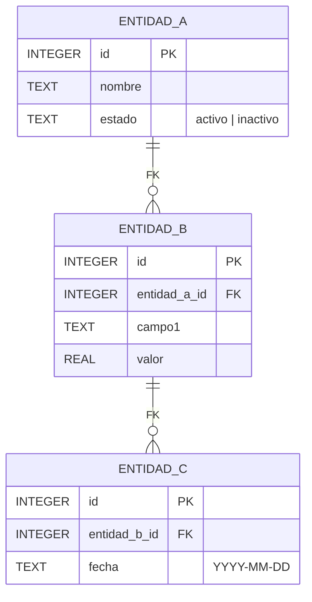

# Documento de Definición Técnica — [Nombre del Proyecto]

> **Propósito:** Única fuente de verdad técnica y funcional para desarrolladores, arquitectos y agentes de IA. Define qué hace el sistema, cómo están organizados sus componentes, cómo fluyen los datos y qué reglas de negocio aplica.
>
> **Cómo usar esta plantilla:** responde primero las preguntas de diseño. Las respuestas determinan qué secciones completar y cuáles eliminar. No publiques secciones en blanco.

---

## Preguntas de diseño — respóndelas antes de escribir

> *Cada pregunta apunta a una sección del documento. Si la respuesta es "no aplica", borra esa sección.*

### ¿Qué tipo de sistema es?

> *La respuesta define qué secciones son obligatorias (marcadas `[X]`) vs. opcionales (`[ ]`).*

| ¿El sistema tiene…? | Si sí → sección obligatoria |
|---|---|
| [ ] Interfaz de usuario (app, dashboard, web) | §6 UI/UX |
| [ ] API REST / GraphQL / RPC expuesta | §4 Contratos de interfaz |
| [ ] Pipeline ETL / scripts de transformación | §2 Flujos de datos |
| [ ] Base de datos (SQL, NoSQL, archivos) | §3 Modelo de datos |
| [ ] Fórmulas matemáticas o índices calculados | §5 Lógica de negocio |
| [ ] Proceso automático / scheduler / tarea | §7 Configuración y despliegue |
| [ ] Integración con APIs externas | §1 Arquitectura + §2 Flujos |
| [ ] Múltiples entornos (local / staging / prod) | §7 Configuración y despliegue |

### ¿Cuál es el problema concreto que resuelve?

- ¿Qué hacen los usuarios **antes** de que exista este sistema? (proceso manual, herramienta que reemplaza)
- ¿Qué hace el sistema que ese proceso no hacía bien? (velocidad, exactitud, escala, automatización)
- ¿Quiénes son los usuarios? (rol, nivel técnico, frecuencia de uso)

> *La respuesta a estas preguntas es el §0 Resumen ejecutivo. Si no puedes responderlas en 3 bullets, el alcance no está claro.*

### ¿Cuántos componentes o capas tiene el sistema?

- ¿Hay una sola app (monolítica) o varios servicios/módulos separados?
- ¿Hay separación entre UI, lógica y datos? ¿O todo está en un solo proceso?
- ¿Hay procesos offline (ETL, scripts) separados de la app online?
- ¿Hay una capa de caché, cola de mensajes, o bus de eventos?

> *La respuesta arma el diagrama de arquitectura de §1. Si son más de 6 componentes principales, agrúpalos por capa.*

### ¿Cómo fluyen los datos de principio a fin?

- ¿De dónde viene el dato original? (usuario, API, archivo, BD externa)
- ¿Qué transformaciones sufre? (validación, cálculo, agregación, enriquecimiento)
- ¿Dónde termina? (tabla, archivo, pantalla, otro sistema)
- ¿Hay flujos secundarios o alternativos? (error, datos faltantes, actualización)

> *La respuesta arma §2 Flujos de datos. Si hay más de 3 flujos distintos, considera separar la arquitectura en `docs/architecture/architecture.md` y referenciarla aquí.*

### ¿Qué reglas de negocio no son obvias?

- ¿Hay fórmulas matemáticas que el sistema calcula? (índices, métricas, scores)
- ¿Hay validaciones que no son simples "campo requerido"? (rangos, relaciones, ventanas temporales)
- ¿Hay lógica condicional relevante? (comportamiento varía según tipo de dato, fuente, configuración)

> *Si no hay fórmulas ni validaciones complejas, borra §5.*

### ¿Cuál es la UI y cómo reacciona?

- ¿Es una app de análisis (el usuario explora datos) o una app transaccional (el usuario crea/edita/borra)?
- ¿Qué controles tiene la UI? (selectores, filtros, formularios, tablas, gráficos)
- ¿Qué cambia cuando el usuario interactúa? (qué datos se recargan, qué cálculos se disparan)

> *Si no hay UI (solo API o solo ETL), borra §6.*

---

## 0. Resumen ejecutivo

> *3–5 bullets. Qué hace el sistema, para quién, y cuáles son sus casos de uso principales. Sin jerga técnica — cualquier persona del equipo debería entenderlo.*

- **Propósito:** [En una oración: qué problema resuelve]
- **Usuarios objetivo:** [Roles: ej. analista agrícola, administrador de datos, proceso automatizado]
- **Casos de uso principales:**
  1. [El usuario/proceso hace X → el sistema hace Y → resultado Z]
  2. [...]
  3. [...]

---

## 1. Arquitectura de componentes

> *Diagrama de las capas y módulos principales. Usa `flowchart LR` o `flowchart TD`.*
>
> *Regla: máximo 8 nodos. Si hay más, agrupa por capa (UI, lógica, datos, procesos externos). Las flechas deben indicar el tipo de dato o protocolo que cruza.*



### Glosario de componentes

| Componente | Responsabilidad | Tecnología | ¿Escribe o solo lee? |
|---|---|---|---|
| `[Nombre]` | [Qué hace en una línea] | [Stack] | [Escribe / Solo lee / Ambas] |
| `[Nombre]` | [Qué hace] | [Stack] | [Escribe / Solo lee] |

---

## 2. Flujos de datos

> *Si hay más de 3 flujos principales, considera documentarlos en `docs/architecture/architecture.md` y solo referenciarlos aquí con el mapa maestro.*

### 2.1 Entradas y salidas

| Dirección | Fuente / Destino | Tipo de dato | Frecuencia |
|---|---|---|---|
| Entrada | [API externa / usuario / archivo] | [JSON, CSV, formulario] | [tiempo real / diario / manual] |
| Salida | [UI / base de datos / API destino] | [tabla, gráfico, reporte] | [por demanda / batch] |

### 2.2 Diagrama de flujo principal


---

## 3. Modelo de datos

> *Diagrama ER del esquema principal. El diccionario completo de columnas va en `docs/db/diseno_db.md`; aquí solo el ER con cardinalidades y los tipos reales.*



### Políticas de integridad

> *Solo las reglas no obvias: qué nunca se borra, qué se regenera, qué no puede ser NULL, qué tiene valores restringidos.*

- **[Política 1]:** [ej: la tabla X nunca se elimina; es la fuente de la verdad]
- **[Política 2]:** [ej: la tabla Y se recrea completa en cada corrida (DROP + CREATE)]
- **[Política 3]:** [ej: el campo Z acepta solo los valores `A | B | C`]

---

## 4. Contratos de interfaz

> *Completa solo el tipo que aplica. Si no hay API externa ni eventos, borra esta sección.*

### 4A. Endpoints API REST (si aplica)

| Método | Endpoint | Descripción | Entrada | Respuesta exitosa |
|---|---|---|---|---|
| `GET` | `/[recurso]` | [Qué devuelve] | *Ninguna* | `[esquema JSON]` |
| `POST` | `/[recurso]` | [Qué crea] | `{"campo": "valor"}` | `{"id": 1, ...}` |

### 4B. Variables de configuración (si aplica)

```bash
# .env.example — variables requeridas para arrancar
[NOMBRE_VAR]=[descripción del valor esperado]
[API_KEY]=[token de autenticación del servicio X]
[DB_PATH]=[ruta al archivo SQLite o URL de conexión]
```

### 4C. Eventos / mensajes asíncronos (si aplica)

```json
{
  "event_type": "[nombre.del.evento]",
  "timestamp": "YYYY-MM-DDTHH:MM:SSZ",
  "data": {
    "[campo_clave]": "[valor representativo]"
  }
}
```

---

## 5. Lógica de negocio y fórmulas

> *Solo si hay cálculos no triviales. Si toda la lógica es CRUD o filtros simples, borra esta sección.*

### 5.1 Índices y fórmulas calculadas

| Índice / Métrica | Fórmula | Umbrales / Restricciones |
|---|---|---|
| `[nombre]` | `[fórmula en texto o LaTeX]` | [ventana temporal, valores válidos, casos NULL] |

### 5.2 Reglas de validación de negocio

- **[Regla 1]:** [descripción; cuándo se aplica; qué pasa si se viola]
- **[Regla 2]:** [ídem]

---

## 6. Interfaz de usuario

> *Solo si hay UI. Si el sistema es solo ETL o solo API, borra esta sección.*

### 6.1 Estructura de la interfaz

> *Lista los controles principales y qué acción dispara cada uno. Un wireframe ASCII solo si realmente ayuda — si no, basta la lista.*

| Control | Tipo | Qué dispara |
|---|---|---|
| `[Nombre del control]` | [selector / botón / slider / tabla] | [qué dato recarga, qué cálculo dispara] |
| `[...]` | | |

### 6.2 Comportamientos reactivos clave

- **[Comportamiento 1]:** cuando el usuario hace X → el sistema hace Y (qué columna, qué gráfico, qué tabla cambia)
- **[Comportamiento 2]:** [ídem]

---

## 7. Configuración y despliegue

### 7.1 Entornos

| Entorno | Cómo arrancar | URL / acceso | Datos que usa |
|---|---|---|---|
| Local / desarrollo | `[comando]` | `http://localhost:[PUERTO]` | `[data local / test]` |
| Producción / deploy | `[comando o proceso]` | `[URL pública]` | `[data_deploy / prod]` |

### 7.2 Automatización

> *Si hay tareas programadas, scripts que corren solos o pipelines de CI/CD.*

| Tarea | Frecuencia | Qué hace | Quién la dispara |
|---|---|---|---|
| `[nombre de la tarea]` | [diario / semanal / manual] | [pasos que ejecuta] | [scheduler / CI / manual] |

### 7.3 Restricciones del entorno

> *Solo las restricciones que un desarrollador nuevo no adivinaría.*

- **[Restricción 1]:** [ej: binarios bloqueados por AppLocker → usar `python -m`]
- **[Restricción 2]:** [ej: bases brutas no se suben al deploy — límite de bundle]
- **[Restricción 3]:** [ej: credenciales en `.env`, nunca en el código]
